# Technical Documentation: PAdES Signing for Mobile with C++, Android & iOS

## Executive Summary

This document provides a comprehensive technical guide to the PAdES remote signing ecosystem, a collection of five interconnected projects designed to facilitate the creation of ETSI-compliant advanced electronic signatures on mobile platforms. The ecosystem is composed of:

1.  A core **PoDoFo C++ Library** for PAdES signing.
2.  A **EUDI Wallet Kotlin Library** for Android (CSC Client).
3.  A **EUDI Wallet Swift Library** for iOS (CSC Client).
4.  An **Android Tester App** to demonstrate the Kotlin library.
5.  An **iOS Tester App** to demonstrate the Swift library.

The documentation is structured into the following key areas:

*   **Part I: PoDoFo PAdES Remote Signing Guide:** A deep dive into the core C++ library's architecture. It details the two-phase remote signing process, explains the PAdES conformance levels (B-B, B-T, B-LT, B-LTA), and analyzes the key classes and workflows involved in creating a digital signature.

*   **Part II & III: PoDoFo to Mobile Bridges:** These chapters explain the bridging technologies that make the C++ library accessible on mobile platforms. Part II covers the JNI bridge for Android, while Part III details the Objective-C++ bridge for iOS, providing tutorials for extending them.

*   **Part IV: CI/CD Workflows:** An overview of the GitHub Actions pipelines used to build, test, and release the libraries for both Android and iOS, ensuring continuous integration and deployment.

*   **Part V & VII: EUDI Wallet Mobile Libraries:** Developer guides for the high-level Kotlin (Android) and Swift (iOS) libraries. These act as clients for the Cloud Signature Consortium (CSC) API and orchestrate the entire signing flow, from authentication to final document creation, using the underlying PoDoFo library.

*   **Part VI & VIII: Mobile Tester Apps:** User guides for the sample Android and iOS applications. They provide a step-by-step walkthrough of a real-world signing scenario, demonstrating how to use the EUDI Wallet libraries to create a PAdES-signed document.

*   **Part IX, X & XI: References, Interoperability, and Glossary:** The final sections provide links to the key ETSI standards, document the successful validation of all generated PDFs with **Adobe Acrobat Reader**, and offer a glossary of technical terms.

This document serves as a complete reference for developers looking to understand, use, or extend any part of the remote signing solution.

## Table of Contents
- [Executive Summary](#executive-summary)
- [I. PoDoFo PAdES Remote Signing Guide](#i-podofo-pades-remote-signing-guide)
  - [1. Introduction](#1-introduction)
  - [2. Core Concepts](#2-core-concepts-expanded)
  - [3. System Architecture](#3-system-architecture)
  - [4. PAdES Conformance Level Workflows](#4-pades-conformance-level-workflows)
  - [5. Component Deep Dive: Class Analysis](#5-component-deep-dive-class-analysis)
  - [6. Deep Dive: Internals of the Signing Process](#6-deep-dive-internals-of-the-signing-process)
  - [7. End-to-End Workflow: A PAdES B-LTA Walkthrough](#7-end-to-end-workflow-a-pades-b-lta-walkthrough)
  - [8. Client Implementation Guide: A `PoDoFo-App.cpp` Deep Dive](#8-client-implementation-guide-a-podofo-appcpp-deep-dive)
  - [9. Troubleshooting Guide](#9-troubleshooting-guide)
  - [10. Building and Running PoDoFo](#10-building-and-running-podofo)
- [II. PoDoFo to Android Bridge: A Developer's Guide](#ii-podofo-to-android-bridge-a-developers-guide)
  - [1. Architecture Overview](#1-architecture-overview)
  - [2. How it Works: The Lifecycle of a Native Object](#2-how-it-works-the-lifecycle-of-a-native-object)
  - [3. Tutorial: Adding a New Function to the Bridge](#3-tutorial-adding-a-new-function-to-the-bridge)
  - [4. Data Type Conversion and Exception Handling](#4-data-type-conversion-and-exception-handling)
- [III. PoDoFo to iOS Bridge: A Developer's Guide](#iii-podofo-to-ios-bridge-a-developers-guide)
  - [1. Architecture Overview](#1-architecture-overview-1)
  - [2. How it Works: The Lifecycle of a Native Object](#2-how-it-works-the-lifecycle-of-a-native-object-1)
  - [3. Tutorial: Adding a New Function to the Bridge](#3-tutorial-adding-a-new-function-to-the-bridge-1)
  - [4. Data Type Conversion and Error Handling](#4-data-type-conversion-and-error-handling)
- [IV. CI/CD: The Build & Release Workflows](#iv-cicd-the-build--release-workflows)
  - [1. Overview](#1-overview)
  - [2. Android Workflow Breakdown (`build-android-podofo.yaml`)](#2-android-workflow-breakdown-build-android-podofoyaml)
  - [3. iOS Workflow Breakdown (`build-ios-podofo.yaml`)](#3-ios-workflow-breakdown-build-ios-podofoyaml)
  - [4. Android Release Workflow (`release-android-podofo.yaml`)](#4-android-release-workflow-release-android-podofoyaml)
- [V. EUDI Wallet Swift Library: A Developer's Guide](#v-eudi-wallet-swift-library-a-developers-guide)
  - [1. Architecture Overview](#1-architecture-overview-2)
  - [2. `RQES`: The High-Level Facade](#2-rqes-the-high-level-facade)
  - [3. `PodofoManager`: Orchestrating the Signing Process](#3-podofomanager-orchestrating-the-signing-process)
  - [4. PAdES Conformance Level Workflows in Swift](#4-pades-conformance-level-workflows-in-swift)
  - [5. Core Services and Utilities](#5-core-services-and-utilities)
- [VI. iOS Tester App: A User Guide](#vi-ios-tester-app-a-user-guide)
  - [1. Introduction](#1-introduction-1)
  - [2. The Signing Flow Step-by-Step](#2-the-signing-flow-step-by-step)
  - [3. Behind the Scenes: `RQESViewModel.swift`](#3-behind-the-scenes-rqesviewmodelswift)
- [VII. EUDI Wallet Kotlin Library: A Developer's Guide](#vii-eudi-wallet-kotlin-library-a-developers-guide)
  - [1. Architecture Overview](#1-architecture-overview-3)
  - [2. `CSCClient`: The High-Level Facade](#2-cscclient-the-high-level-facade)
  - [3. `PodofoManager`: Orchestrating the Signing Process](#3-podofomanager-orchestrating-the-signing-process-1)
  - [4. PAdES Conformance Level Workflows in Kotlin](#4-pades-conformance-level-workflows-in-kotlin)
  - [5. Core Services and Utilities](#5-core-services-and-utilities-1)
- [VIII. Android Tester App: A User Guide](#viii-android-tester-app-a-user-guide)
  - [1. Introduction](#1-introduction-2)
  - [2. The Signing Flow Step-by-Step](#2-the-signing-flow-step-by-step-1)
  - [3. Behind the Scenes: `MainActivity.kt`](#3-behind-the-scenes-mainactivitykt)
- [IX. Key Standards and References](#ix-key-standards-and-references)
  - [1. PAdES Standards](#1-pades-standards)
  - [2. Testing and Interoperability](#2-testing-and-interoperability)
- [X. All PDFs Validated with Adobe Acrobat Reader](#x-all-pdfs-validated-with-adobe-acrobat-reader)
- [XI. Glossary of Terms](#xi-glossary-of-terms)


---

## I. PoDoFo PAdES Remote Signing Guide

### 1. Introduction

This document provides a detailed technical overview of the PDF remote signing and Long-Term Validation (LTV) architecture within the PoDoFo library. The system is designed to facilitate the creation of digitally signed PDF documents conforming to PAdES (PDF Advanced Electronic Signatures) standards, particularly in scenarios where the private key for signing is managed by a remote service or Hardware Security Module (HSM).

The core of this system is the `PdfRemoteSignDocumentSession` class, which acts as a high-level facade, orchestrating a complex workflow involving hash generation, remote signing, timestamping, and the collection of validation materials (certificates, CRLs, OCSP responses) required for Long-Term Validation (LTV).

### 2. Core Concepts (Expanded)

Before diving into the class details, it's important to understand the foundational concepts that govern the signing process.

#### Remote Signing (Two-Phase Signing)

This architecture is built on a "two-phase" or "deferred" signing model. The key principle is that the library **never handles the private signing key directly**. This separation of responsibilities is crucial for security in modern enterprise environments.

*   **Why it's used:** Private keys are highly sensitive and often stored in secure, audited environments like Hardware Security Modules (HSMs) or cloud-based key management services. The remote signing model allows applications to get documents signed without having direct access to these keys, minimizing risk.
*   **Phase 1: Hash Calculation:** The library prepares the PDF document for signing, which involves creating a signature placeholder. It then calculates a cryptographic hash (e.g., SHA-256) of the precise byte ranges of the document that need to be signed. This hash is a unique, fixed-size fingerprint of the content. This hash is what `beginSigning()` returns.
*   **Phase 2: Signature Injection:** The client application sends this hash to the remote signing service. The service uses the private key to encrypt the hash, producing the digital signature. This signature is returned to the client. The client then calls `finishSigning()`, passing the signature to the library, which injects it into the placeholder in the PDF.

#### PAdES (PDF Advanced Electronic Signatures)

PAdES is an ETSI standard that defines specific profiles for advanced electronic signatures in PDF documents to ensure long-term validity. The library supports a progression of these profiles, each adding more robustness.

*   **Level B-B (Basic):** This is the fundamental signature. It contains the signed hash of the document and the signer's certificate. While it proves the document's integrity and links it to the signer, it can become difficult to validate in the future, especially if the signer's certificate expires.

*   **Level B-T (Timestamp):** This level enhances a B-B signature by adding a trusted timestamp. The `signedHash` from the B-B level is sent to a **Timestamp Authority (TSA)**, a trusted third party. The TSA creates its own signature over this hash and the current time, generating a Timestamp Response (TSR). This TSR is added to the signature. Its purpose is to provide non-repudiation; it proves that the signature existed *before* a specific point in time, which is critical for validating a signature after the signer's certificate has expired or been revoked.

*   **Level B-LT (Long Term):** This level makes the signature verifiable for many years without needing to contact external services. The problem with B-T is that while the timestamp proves *when* the signature was made, a verifier still needs to check if the signer's certificate (and the TSA's certificate) was valid at that time. This requires checking Certificate Revocation Lists (CRLs) or using the Online Certificate Status Protocol (OCSP). These external services may not be available years later. The B-LT level solves this by embedding all this validation material directly into the PDF's **Document Security Store (DSS)**. This includes:
    *   The full certificate chain required to validate the signer.
    *   The OCSP responses or CRLs for each certificate in the chain.
    *   This makes the PDF a self-contained package for validation.

*   **Level B-LTA (Long Term with Archive Timestamp):** This is the highest level of robustness, designed for archiving documents for decades. It addresses the risk that the cryptographic algorithms used in the signature or timestamps might become weak over time. After a B-LT signature is complete, a document-level timestamp is applied to the *entire PDF file*, including the previous signature and all the embedded validation data. This new timestamp uses a current, strong algorithm. This process can be repeated periodically (e.g., every 5-10 years) to "re-harden" the document's integrity against future cryptographic vulnerabilities.

#### CMS (Cryptographic Message Syntax)

Also known as PKCS#7, this is the standardized format for the digital signature that is embedded within the PDF's `/Contents` field. It's essentially a container or an "envelope" that holds:
*   The signed hash of the document.
*   The signer's certificate (and optionally the chain).
*   **Signed Attributes:** Additional data that is cryptographically tied to the signature, such as the signing time and the hash of the signer's certificate (ESS signing-certificate-v2 attribute).
*   **Unsigned Attributes:** Additional data that is not covered by the signature itself but is associated with it. The most common example is the timestamp token from a TSA, as required for PAdES B-T and above.

The `PdfSignerCms` and `CmsContext` classes are responsible for correctly constructing this complex data structure according to the standards.

#### Supported Standards

To ensure clarity for developers, this section explicitly lists the standards supported by the library.

##### PAdES Conformance Levels
The library supports the following PAdES conformance levels, which can be specified during the initialization of the `PdfRemoteSignDocumentSession`:
*   `ADES_B_B`: Basic signature.
*   `ADES_B_T`: Signature with a trusted timestamp.
*   `ADES_B_LT`: Signature with long-term validation material.
*   `ADES_B_LTA`: Signature with a long-term archive timestamp.

##### Hash Algorithms
The library supports the following cryptographic hash algorithms, which must be specified by their Object Identifier (OID) string:
*   **SHA-256:** `"2.16.840.1.101.3.4.2.1"`
*   **SHA-384:** `"2.16.840.1.101.3.4.2.2"`
*   **SHA-512:** `"2.16.840.1.101.3.4.2.3"`

### 3. System Architecture

The signing process involves several collaborating classes, each with a distinct responsibility. The `PdfRemoteSignDocumentSession` acts as the primary entry point, hiding the complexity of the underlying components.

#### Component Relationship Diagram

This diagram illustrates the main components and their relationships. The flow of control generally moves from the client application down through the layers of the library, with the client also being responsible for interacting with external network services.

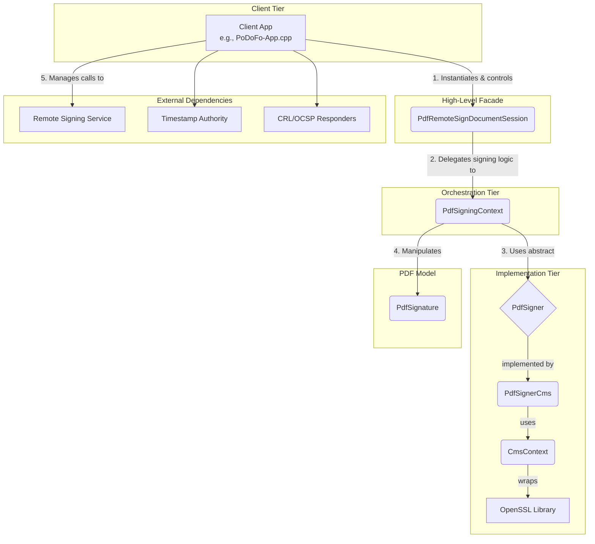
```mermaid
graph TD
    subgraph "Client Tier"
        Client[Client App <br/> e.g., PoDoFo-App.cpp]
    end

    subgraph "High-Level Facade"
        Session(PdfRemoteSignDocumentSession)
    end

    subgraph "Orchestration Tier"
        Context(PdfSigningContext)
    end

    subgraph "Implementation Tier"
        SignerInterface{PdfSigner} -- "implemented by" --> SignerImpl(PdfSignerCms)
        SignerImpl -- "uses" --> Cms(CmsContext)
        Cms -- "wraps" --> OpenSSL[OpenSSL Library]
    end
    
    subgraph "PDF Model"
        SignatureField(PdfSignature)
    end

    subgraph "External Dependencies"
        SigningService[Remote Signing Service]
        TSA[Timestamp Authority]
        RevocationServices[CRL/OCSP Responders]
    end

    Client -->|"1. Instantiates & controls"| Session
    Session -->|"2. Delegates signing logic to"| Context
    Context -->|"3. Uses abstract"| SignerInterface
    Context -->|"4. Manipulates"| SignatureField
    
    Client -->|"5. Manages calls to"| SigningService
    Client -->|" " | TSA
    Client -->|" " | RevocationServices
```

#### Component Descriptions

*   **Client Tier (`PoDoFo-App.cpp`):** The end user of the library. It is responsible for gathering all necessary data (PDFs, certificates), orchestrating calls to external network services (for signing, timestamping, etc.), and driving the process by calling the high-level facade.

*   **High-Level Facade (`PdfRemoteSignDocumentSession`):** This is the primary public API. It provides a simplified, stateful interface (`beginSigning`, `finishSigning`, etc.) for a single signing session. It holds the configuration and hides the complex interactions between the orchestration and implementation tiers.

*   **Orchestration Tier (`PdfSigningContext`):** This is the engine of the signing process. It's responsible for the complex two-phase workflow:
    1.  Preparing the PDF by adding placeholders for the signature.
    2.  Saving the document and hashing the relevant byte ranges.
    3.  Returning the hash to be signed.
    4.  Later, taking the signed hash and embedding the final signature into the document.

*   **Implementation Tier (`PdfSigner`, `PdfSignerCms`, `CmsContext`):** This layer is responsible for the cryptographic work of creating the signature container.
    *   `PdfSigner` is an abstract interface, allowing for different signature formats.
    *   `PdfSignerCms` is the concrete implementation that creates CMS/PKCS#7 signature structures.
    *   `CmsContext` is a private helper that encapsulates the low-level and often complex calls to the OpenSSL library, keeping the rest of the code cleaner.

*   **PDF Model (`PdfSignature`):** This class represents the actual signature field object within the PDF document's internal structure. `PdfSigningContext` interacts with it to insert the necessary dictionaries and placeholders.

---

### 4. PAdES Conformance Level Workflows

The library supports different PAdES conformance levels, each building upon the last. The interaction between the client application and the library changes depending on the desired level.

#### PAdES B-B (Basic Signature)

This is the simplest level, providing a basic digital signature without a timestamp or long-term validation data.

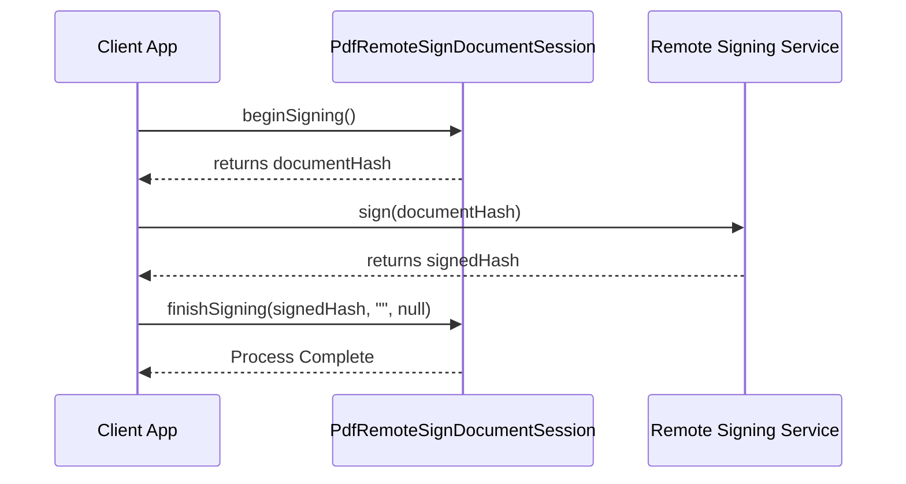
```mermaid
sequenceDiagram
    participant App as Client App
    participant Session as PdfRemoteSignDocumentSession
    participant RemoteSigner as Remote Signing Service

    App->>Session: beginSigning()
    Session-->>App: returns documentHash

    App->>RemoteSigner: sign(documentHash)
    RemoteSigner-->>App: returns signedHash

    App->>Session: finishSigning(signedHash, "", null)
    Session-->>App: Process Complete
```

**Flow Description:**
1.  **Get Hash:** The client calls `beginSigning()`. The library prepares the PDF, calculates the hash that needs to be signed, and returns it.
2.  **Sign Hash:** The client sends this hash to its remote signing service.
3.  **Embed Signature:** The client calls `finishSigning()`, providing the returned `signedHash`. The library embeds this into the PDF, completing the signature.

---

#### PAdES B-T (Signature with Timestamp)

This level adds a trusted timestamp from a Timestamp Authority (TSA) to prove that the signature existed at a specific point in time.

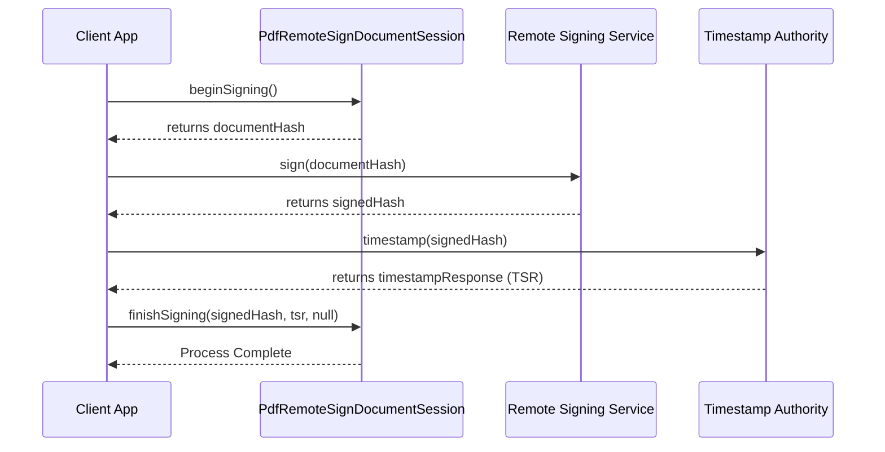
```mermaid
sequenceDiagram
    participant App as Client App
    participant Session as PdfRemoteSignDocumentSession
    participant RemoteSigner as Remote Signing Service
    participant TSA as Timestamp Authority

    App->>Session: beginSigning()
    Session-->>App: returns documentHash

    App->>RemoteSigner: sign(documentHash)
    RemoteSigner-->>App: returns signedHash

    App->>TSA: timestamp(signedHash)
    TSA-->>App: returns timestampResponse (TSR)

    App->>Session: finishSigning(signedHash, tsr, null)
    Session-->>App: Process Complete
```

**Flow Description:**
1.  **Get Hash & Sign:** The flow is the same as B-B to get the `signedHash`.
2.  **Get Timestamp:** The client sends the `signedHash` (the signature itself) to a TSA. The TSA returns a timestamp token (TSR) which is itself a signed data structure.
3.  **Embed Signature & Timestamp:** The client calls `finishSigning()`, providing both the `signedHash` and the `timestampResponse`. The library embeds the signature, and adds the timestamp as an unsigned attribute within the CMS signature container.

---

#### PAdES B-LT (Long-Term Validation)

This level embeds all necessary validation material (certificates and revocation information) into the PDF's Document Security Store (DSS), allowing the signature to be validated long after the original certificates have expired.

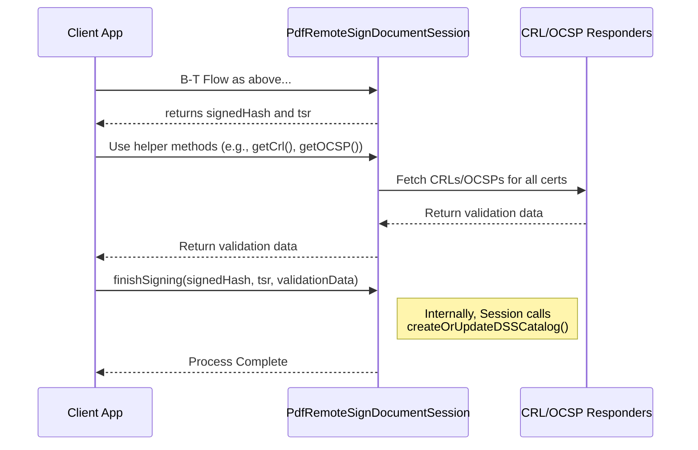
```mermaid
sequenceDiagram
    participant App as Client App
    participant Session as PdfRemoteSignDocumentSession
    participant RevocationServices as CRL/OCSP Responders

    App->>Session: B-T Flow as above...
    Session-->>App: returns signedHash and tsr

    App->>Session: Use helper methods (e.g., getCrl(), getOCSP())
    Session->>RevocationServices: Fetch CRLs/OCSPs for all certs
    RevocationServices-->>Session: Return validation data
    Session-->>App: Return validation data

    App->>Session: finishSigning(signedHash, tsr, validationData)
    note right of Session: Internally, Session calls<br/>createOrUpdateDSSCatalog()
    Session-->>App: Process Complete
```

**Flow Description:**
1.  **B-T Flow:** The process starts identically to the B-T flow.
2.  **Gather Validation Data:** *Before* finishing, the client is responsible for gathering all required validation materials. The `PdfRemoteSignDocumentSession` provides convenient helper methods (`getCrlFromCertificate`, `getOCSPRequestFromCertificatesWithFallback`, etc.) for this purpose. The client calls these methods to fetch CRLs and/or OCSP responses for the signer's certificate chain and the TSA's certificate chain. This often involves multiple network requests.
3.  **Embed All Data:** The client calls `finishSigning()`, providing the `signedHash`, the `timestampResponse`, and the collected `validationData`. The library performs the B-T embedding and then injects all the validation artifacts into the PDF's DSS.

---

#### PAdES B-LTA (Long-Term with Archive Timestamp)

This is the highest level, adding a final document-level timestamp that covers the entire PDF, including the signature and all the LTV data added in the B-LT step. This protects against future cryptographic weaknesses.

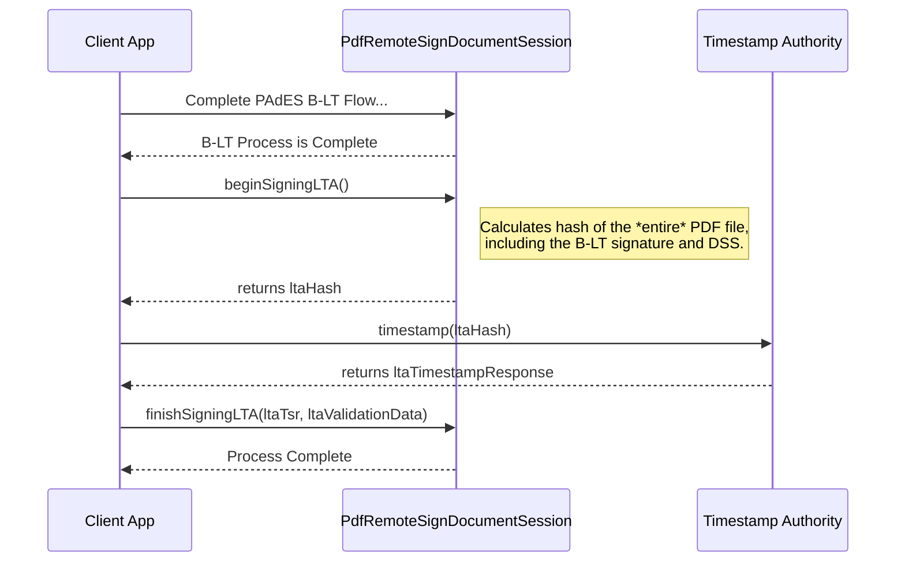
```mermaid
sequenceDiagram
    participant App as Client App
    participant Session as PdfRemoteSignDocumentSession
    participant TSA as Timestamp Authority

    App->>Session: Complete PAdES B-LT Flow...
    Session-->>App: B-LT Process is Complete

    App->>Session: beginSigningLTA()
    note right of Session: Calculates hash of the *entire* PDF file,<br/>including the B-LT signature and DSS.
    Session-->>App: returns ltaHash

    App->>TSA: timestamp(ltaHash)
    TSA-->>App: returns ltaTimestampResponse

    App->>Session: finishSigningLTA(ltaTsr, ltaValidationData)
    Session-->>App: Process Complete
```

**Flow Description:**
1.  **Complete B-LT:** The entire PAdES B-LT process must be completed first. The resulting PDF is saved.
2.  **Get LTA Hash:** The client calls `beginSigningLTA()`. The library opens the B-LT signed PDF, calculates a hash over the *entire file*, and returns this `ltaHash`.
3.  **Get LTA Timestamp:** The client sends this new hash to a TSA to get a document timestamp. The client may also gather validation data for this new timestamp.
4.  **Embed LTA Timestamp:** The client calls `finishSigningLTA()`, providing the new timestamp. The library adds a new signature field to the PDF and embeds this final document timestamp, completing the LTA level.

### 5. Component Deep Dive: Class Analysis

This chapter provides a more detailed look at the crucial classes involved in the signing process, explaining their specific responsibilities and key functions.

#### `PdfRemoteSignDocumentSession`

As the main public-facing class, `PdfRemoteSignDocumentSession` serves as a facade, simplifying the complex signing process into a manageable, stateful session. It is the primary entry point for any client application wanting to perform a remote signature.

*   **Responsibility:** To orchestrate the entire end-to-end remote signing workflow, manage configuration and state for a single signing operation, and provide helper utilities to the client for gathering validation data.

*   **State Management:** An instance of this class is designed for a single, complete signing operation (e.g., creating one B-LTA signature). It holds all the necessary configuration and state, including:
    *   **Configuration:** The input/output file paths, PAdES conformance level, hash algorithm, and the full certificate chain, all provided in the constructor.
    *   **Decoded Data:** Upon construction, it immediately decodes the provided Base64 certificates into their raw DER format (`_endCertificateDer`, `_certificateChainDer`), preparing them for use in cryptographic operations.
    *   **Core Objects:** It owns and manages the lifecycle of the primary internal objects: `_doc` (the `PdfMemDocument` being worked on), `_stream` (the file stream for the output PDF), `_ctx` (the `PdfSigningContext`), and `_signer` (the `PdfSignerCms` instance). For LTA operations, it manages a separate set of these objects (`_ltaDoc`, `_ltaCtx`, etc.).

*   **Core API in Detail:**
    *   `beginSigning()`: This method orchestrates Phase 1. Internally, it:
        1.  Copies the input PDF to the output path.
        2.  Creates a new `PdfSignature` field in the PDF.
        3.  Instantiates and configures its internal `PdfSignerCms` with the appropriate certificates and parameters.
        4.  Instantiates its `PdfSigningContext` and adds the signer.
        5.  Calls `_ctx.StartSigning(...)`, which performs the complex process of preparing placeholders, saving the file, and calculating the hash.
        6.  Returns the final, URL-encoded hash to the client.
    *   `finishSigning()`: This method orchestrates Phase 2. Internally, it:
        1.  Takes the `signedHash`, `base64Tsr`, and `validationData` from the client.
        2.  If a timestamp is provided (for B-T and above), it calls `_signer->SetTimestampToken()` to add it to the CMS signature's unsigned attributes.
        3.  Calls `_ctx.FinishSigning(...)`, passing in the `signedHash`. The context takes over to inject the final signature blob and update the `/ByteRange`.
        4.  If `validationData` is provided (for B-LT and above), it then calls its private `createOrUpdateDSSCatalog()` method. This method opens the newly signed PDF, finds or creates the `/DSS` dictionary, and adds the provided certificates, CRLs, and OCSP responses as new PDF stream objects.
    *   `beginSigningLTA()` / `finishSigningLTA()`: This pair manages the separate and distinct workflow for adding the final archive timestamp. This process is fundamentally different from the primary signature.
        *   **Why is it separate?** The LTA timestamp must cover the *entirety* of the already-signed document, including the first signature's `/Contents` and the `/DSS`. It acts as a seal over the final state of the B-LT signed document. This requires a new, separate signing operation.
        *   **`beginSigningLTA()` Internal Logic:**
            1.  It re-loads the now-signed PDF from the output file.
            2.  It creates a **new, second signature field** in the document, specifically for the document timestamp.
            3.  Crucially, it instantiates the specialized `PdfDocTimeStampSigner`. This signer is tailored for RFC3161 timestamps, not standard CMS signatures.
            4.  It calls a new `PdfSigningContext` instance to perform the Phase 1 hashing. `PdfDocTimeStampSigner`'s implementation hashes the entire file content to produce the `ltaHash`.
        *   **`finishSigningLTA()` Internal Logic:**
            1.  It takes the `base64TsrLta` (the new timestamp) from the client.
            2.  It calls its LTA signing context to finish the process.
            3.  The `PdfDocTimeStampSigner` directly embeds the received timestamp token as the `/Contents` of the new signature field, fulfilling the RFC3161 format.
            4.  It can optionally add any validation data for the LTA timestamp's TSA certificate to the DSS.

*   **Client Helpers in Detail:** The class provides several public utility methods that are essential for the client to fulfill its role in gathering LTV data. These helpers are critical because they abstract away complex and error-prone OpenSSL parsing logic.
    *   `extractSignerCertFromTSR()` / `extractIssuerCertFromTSR()`: These are needed because a TSA's response (TSR) contains the TSA's own certificate, which the client needs to validate. Often, the response *also* contains the TSA's issuer certificate, but not always.
    *   `getOCSPRequestFromCertificatesWithFallback()`: This is a particularly important helper. To get an OCSP response for a certificate, you need both the certificate itself and its issuer's certificate. As noted above, the issuer certificate is not always readily available. This method provides a robust, two-step process:
        1.  It first tries to find the issuer certificate within the provided data (e.g., inside a TSR).
        2.  If that fails, it inspects the certificate for an **Authority Information Access (AIA)** extension, which often contains a URL pointing to the issuer's certificate. The method can then use an `httpFetcher` function (provided by the client) to download the missing certificate, enabling the OCSP request to be built successfully. This fallback logic is vital for reliable LTV data collection.

#### `ValidationData`

This class is a simple but crucial data structure used to pass validation artifacts from the client application into the signing session.

*   **Responsibility:** To act as a container for the collections of certificates, CRLs, and OCSP responses that are required for PAdES B-LT and B-LTA signatures.
*   **Structure:** It holds three vectors of Base64-encoded strings: `certificatesBase64`, `crlsBase64`, and `ocspsBase64`. The `PdfRemoteSignDocumentSession` takes this object in its `finishSigning` method and uses the data to populate the PDF's DSS.

#### `PdfSignature` (`PdfSignature.h`, `PdfSignature.cpp`)

This class models a signature field in the PDF's AcroForm.

*   **Responsibility:** To manage the properties and dictionaries associated with a signature field.
*   **Key Functions:**
    *   `PrepareForSigning(...)`: This is a critical setup step called by `PdfSigningContext`. It creates the signature's value dictionary (`/V`) and adds placeholder keys:
        *   `/Contents`: A placeholder string of zeros that reserves space for the final CMS signature blob. The size is determined by a `dryrun` signature generation.
        *   `/ByteRange`: An array that will define which byte ranges of the file are covered by the signature hash. It's also a placeholder initially.
    *   `SetContentsByteRangeNoDirtySet(...)`: After signing is complete, this function is called to update the `/Contents` and `/ByteRange` with the final values. The `NoDirtySet` is important to avoid changes that would invalidate the hash that was just calculated.
    *   `SetSignerName(...)`, `SetSignatureReason(...)`, etc.: These methods set standard, human-readable properties in the signature dictionary.

#### `PdfSigner` (`PdfSigner.h`, `PdfSigner.cpp`)

This abstract base class is the cornerstone of the signing implementation, defining a generic contract for any signing algorithm or format. By programming to this interface, `PdfSigningContext` remains decoupled from the specifics of CMS/PKCS#7, making the system extensible in the future.

*   **Responsibility:** To define the essential, format-agnostic steps of a digital signing process: consuming data for hashing, producing a signature, and supporting a two-phase (deferred) workflow.
*   **Key Virtual Functions in Detail:**
    *   `Reset()`: Prepares the signer instance for a new operation, clearing any intermediate state from previous runs.
    *   `AppendData(data)`: This is the core method for hashing. `PdfSigningContext` streams the contents of the PDF file to the signer through this method. The implementation is responsible for incrementally updating its internal hash state with this data.
    *   `ComputeSignature(contents, dryrun)`: Used for a simple, single-call signing workflow. When `dryrun` is `true`, it must calculate and return the *expected size* of the final signature container without actually creating a signature. This is critical for reserving space in the PDF.
    *   `FetchIntermediateResult(result)`: This is the key method for **Phase 1** of remote signing. After all data has been passed via `AppendData`, this method finalizes the hash calculation and returns the raw digest that must be sent to the remote signer.
    *   `ComputeSignatureDeferred(processedResult, contents, dryrun)`: This is the key method for **Phase 2** of remote signing. It takes the `processedResult` (the signature received from the remote service) and uses it to construct the final signature container (e.g., the CMS blob).

#### `PdfSignerCms` & `CmsContext` (`.h`, `.cpp` files)

This pair of classes provides the concrete implementation for creating CMS (PKCS#7) signatures, which is the standard for PAdES.

##### `PdfSignerCms`
This class implements the `PdfSigner` interface and acts as a bridge between the high-level orchestration of `PdfSigningContext` and the low-level cryptographic operations handled by `CmsContext`.

*   **Responsibility:** To translate the generic `PdfSigner` calls into specific CMS-related operations and to manage the configuration and attributes of the CMS signature.
*   **Key Operations:**
    *   It takes the signer's certificates and signing parameters (`PdfSignerCmsParams`) in its constructor.
    *   In `FetchIntermediateResult`, it instructs its `CmsContext` to finalize the hash of the document content plus any signed attributes, returning the result.
    *   In `ComputeSignatureDeferred`, it passes the remotely signed hash to its `CmsContext` to be embedded into the CMS structure.
    *   `SetTimestampToken(...)`: A crucial method for PAdES B-T and higher. It takes a raw TSR and passes it to the `CmsContext`

### 6. Deep Dive: Internals of the Signing Process

This chapter breaks down the core technical operations that occur under the hood during the signing process and identifies the classes responsible for them.

#### Raw Hash Calculation

The calculation of the raw hash to be signed is one of the most critical and complex parts of the process. The goal is to create a digest of the entire PDF file *except for the signature container itself*.

*   **Process:**
    1.  **Placeholder Creation:** The process begins by inserting a placeholder for the signature's `/Contents` field into the PDF's object structure. This placeholder is a long string of zeros. The size of this placeholder is determined by a "dry run" signature generation, which estimates the final size of the CMS blob.
    2.  **File Serialization:** The entire PDF document, including the placeholder, is written to a file or memory stream. At this point, the file has its final structure, but the signature is just empty space.
    3.  **Selective Hashing:** The library then reads the file back, but not all at once. It reads the block of bytes from the start of the file right up to the beginning of the placeholder. It then skips over the placeholder and reads the second block of bytes from the end of the placeholder to the end of the file. These two blocks are fed into a hashing algorithm (e.g., SHA-256).
    4.  **Digest Finalization:** The resulting hash is the final digest that needs to be signed.
*   **Responsible Class:** `PdfSigningContext` is the primary orchestrator of this process. It drives the saving of the document and the selective reading, while the `PdfSignerCms` (and its internal `CmsContext`) is responsible for performing the actual incremental hashing via its `AppendData` method and finalizing the hash via `FetchIntermediateResult`.

#### Signature Embedding

Once the client application receives the signed hash from the remote service, it must be embedded back into the PDF without invalidating the hash that was just calculated.

*   **Process:**
    1.  **CMS Construction:** The remotely signed hash, along with any timestamp tokens, are passed to the `CmsContext`. This class constructs the full CMS/PKCS#7 signature container. This container includes the signed hash, the signer's certificate, and other attributes, and is then DER-encoded into a final binary blob.
    2.  **Placeholder Overwriting:** The `PdfSigningContext` seeks to the exact byte offset in the file where the zero-placeholder was written in Phase 1. It then overwrites this block of zeros with the new CMS blob. Because the size was pre-calculated in the dry run, the new data fits perfectly into the reserved space.
*   **Responsible Classes:** `PdfSignerCms` and `CmsContext` are responsible for building the CMS blob. `PdfSigningContext` is responsible for the file I/O, seeking to the correct position and overwriting the placeholder.

#### ByteRange Calculation

The `/ByteRange` entry in the signature dictionary tells a PDF viewer exactly which bytes of the file were included in the hash calculation. It's an array of integers, typically in pairs of `[start_offset_1, length_1, start_offset_2, length_2, ...]`.

*   **Process:**
    1.  After the signature is embedded, the file is in its final state. The `PdfSigningContext` now has all the information it needs.
    2.  It calculates the four integer values:
        *   `start_offset_1` is always 0.
        *   `length_1` is the byte offset of the start of the `/Contents` placeholder.
        *   `start_offset_2` is the byte offset of the end of the `/Contents` placeholder.
        *   `length_2` is the number of bytes from `start_offset_2` to the end of the file.
    3.  This array of four integers is then written over the initial `/ByteRange` placeholder in the PDF.
*   **Responsible Class:** `PdfSigningContext` is solely responsible for calculating and writing the final `/ByteRange`.

#### Timestamping

Timestamping provides proof that a signature existed at a certain time. The library handles two types of timestamps differently.

*   **Signature Timestamp (PAdES B-T):** This timestamp is applied to the signature itself.
    *   **Process:** The client sends the `signedHash` to a TSA. The TSA returns a Timestamp Response (TSR). This TSR is a CMS structure in its own right. The client passes this TSR to `finishSigning`. Inside `PdfSignerCms`, this TSR is added as an **unsigned attribute** to the main signature's CMS container before it is finalized and embedded. It's "unsigned" because it's not part of the data covered by the primary signature's hash.
    *   **Responsible Classes:** `PdfSignerCms` and `CmsContext` are responsible for adding the timestamp token to the CMS attributes.

*   **Document Timestamp (PAdES B-LTA):** This timestamp is applied to the entire document *after* the primary signature is complete.
    *   **Process:** The client calls `beginSigningLTA()`. This initiates a new, separate signing operation using the specialized `PdfDocTimeStampSigner`. This signer calculates a hash over the *entire file content* of the already-signed B-LT document. The client sends this hash to a TSA and gets back a TSR. In `finishSigningLTA`, this TSR is embedded directly as the `/Contents` of a *new, second signature field*. It is not an attribute of the first signature.
    *   **Responsible Classes:** `PdfRemoteSignDocumentSession` orchestrates this by using the `PdfDocTimeStampSigner`, which is specifically designed for this RFC3161-style signature format.

### 7. End-to-End Workflow: A PAdES B-LTA Walkthrough

The `PdfRemoteSignDocumentSession` class ties everything together into a simple, coherent API for client applications. To illustrate how it's used in practice, this chapter details the typical sequence of calls and client-side responsibilities for creating a full PAdES B-LTA signature, the most comprehensive type.

#### Step 1: Initialization

*   **Client Action:** The client application instantiates a `PdfRemoteSignDocumentSession` object.
*   **Parameters:** It provides all the necessary up-front configuration:
    *   The desired conformance level (`"ADES_B_LTA"`).
    *   The OID of the hash algorithm to be used (e.g., `"2.16.840.1.101.3.4.2.1"` for SHA-256).
    *   Input and output file paths.
    *   The signer's end-entity certificate and the chain of intermediate certificates, all Base64-encoded.
*   **Internal Action (`PdfRemoteSignDocumentSession`):** The session object stores this configuration and immediately decodes the provided certificates into a DER format that OpenSSL can use.

#### Step 2: Phase 1 - Document Hashing

*   **Client Action:** The client calls `session.beginSigning()`.
*   **Internal Action (`PdfRemoteSignDocumentSession`):**
    1.  The session creates its internal `PdfSigningContext` and `PdfSignerCms` objects.
    2.  It delegates control to `_ctx.StartSigning(...)`.
    3.  The context performs the complex hashing process (dry run, placeholder creation, saving, and selective hashing).
    4.  The context returns the calculated document hash.
*   **Return Value:** The session URL-encodes the raw hash and returns this string to the client.

#### Step 3: Client-Side Remote Operations (Part 1)

This step is performed entirely by the client application, demonstrating the separation of concerns.

*   **Client Action:**
    1.  **Get Signature:** The client takes the `documentHash` and sends it to the remote signing service it is integrated with. The service returns the `signedHash`.
    2.  **Get Signature Timestamp:** Since the goal is B-LTA (which builds on B-T), the client immediately sends the `signedHash` to a configured Timestamp Authority (TSA). The TSA returns a `timestampResponse` (TSR).
    3.  **Gather Validation Data:** The client begins populating a `ValidationData` object. It uses the helper methods on the `session` object to fetch all necessary CRLs and OCSP responses for both the signer's certificate chain and the TSA's certificate chain. This often involves multiple network requests.

#### Step 4: Phase 2 - Signature and LTV Embedding

*   **Client Action:** The client calls `session.finishSigning(signedHash, timestampResponse, validationData)`.
*   **Internal Action (`PdfRemoteSignDocumentSession`):**
    1.  The session passes the `timestampResponse` to its internal `PdfSignerCms` instance.
    2.  It delegates control to `_ctx.FinishSigning(...)`, passing the `signedHash`.
    3.  The context embeds the final CMS signature (which now includes the timestamp) into the PDF and updates the `/ByteRange`.
    4.  After the context finishes, the session calls its private `createOrUpdateDSSCatalog()` method, which takes all the items from the `validationData` object and writes them into the PDF's Document Security Store (DSS).
*   **Result:** At this point, the output file is a valid PAdES B-LT signed PDF.

#### Step 5: Phase 3 - LTA Document Timestamping

This final phase seals the document for long-term archiving.

*   **Client Action:** The client calls `session.beginSigningLTA()`.
*   **Internal Action (`PdfRemoteSignDocumentSession`):**
    1.  The session initiates a new, separate signing context specifically for the archive timestamp, using the specialized `PdfDocTimeStampSigner`.
    2.  This new context calculates a hash of the *entire* B-LT signed PDF file.
*   **Return Value:** The session returns this new `ltaHash` to the client.

#### Step 6: Client-Side Remote Operations (Part 2)

*   **Client Action:**
    1.  **Get LTA Timestamp:** The client sends the `ltaHash` to a TSA (can be the same one as before or a different one) and receives an `ltaTimestampResponse`.
    2.  **Gather LTA Validation Data (Optional):** The client may optionally gather OCSP/CRL data for the TSA's certificate used for this new timestamp.

#### Step 7: Phase 4 - Embedding the Archive Timestamp

*   **Client Action:** The client calls `session.finishSigningLTA(ltaTimestampResponse, ltaValidationData)`.
*   **Internal Action (`PdfRemoteSignDocumentSession`):**
    1.  The session's LTA signing context takes the `ltaTimestampResponse` and embeds it directly into a new, second signature field in the PDF.
    2.  If provided, the LTA validation data is also added to the DSS.
*   **Result:** The process is complete. The output file is now a valid PAdES B-LTA signed PDF, representing the highest level of signature robustness provided by the library.

---

### 8. Client Implementation Guide: A `PoDoFo-App.cpp` Deep Dive

The example application (`PoDoFo-App.cpp`) serves as a reference implementation, demonstrating how to correctly use the `PdfRemoteSignDocumentSession` facade to perform a complete signing operation. It highlights the crucial division of responsibilities between the PoDoFo library and the client application.

#### Key Client Responsibilities

The example illustrates that the client application is fundamentally an **orchestrator**. The PoDoFo library provides the complex PDF manipulation and cryptographic primitives, but the client is responsible for:

1.  **Configuration:** Loading all necessary data, including file paths, certificates, and endpoints for external services.
2.  **Driving the Workflow:** Calling the `PdfRemoteSignDocumentSession` methods in the correct sequence (`beginSigning`, `finishSigning`, etc.).
3.  **Managing Network Communication:** Implementing the logic to communicate with all required external services:
    *   A remote signing service (HSM, cloud KMS, etc.).
    *   A Timestamp Authority (TSA).
    *   Certificate Revocation List (CRL) distribution points.
    *   OCSP responders.

#### Analysis of `processSigningCombination`

This function in `PoDoFo-App.cpp` is the heart of the example. It simulates a complete, real-world signing scenario from start to finish. Below is a breakdown of its logic, which directly maps to the end-to-end workflow described in the previous chapter.

##### **Step 1: Setup and Initialization**

*   **Explanation:** This mirrors the "Initialization" step. The client gathers all its dependencies and configuration data *before* starting the signing process. The creation of the `session` object, providing it with certificates, file paths, and the desired PAdES level, is the official start of the workflow.
*   **Code Snippet:**
    ```cpp
    // The client first gathers credentials, which includes the signer's certificate
    // and the certificate chain.
    CertificateBundle bundle = GetCredentials();
    
    // It then instantiates the session object, providing all the necessary
    // configuration parameters up front.
    PdfRemoteSignDocumentSession session{
            conformanceLevel,
            hash_algo,
            inputPdf,
            outputPdf,
            bundle.firstCert,
            bundle.chainCertificates,
            std::nullopt,
            label
    };
    ```

##### **Step 2: Get Document Hash (`beginSigning`)**

*   **Explanation:** The client makes a single, simple call to kick off Phase 1. As detailed previously, this call triggers a cascade of internal operations within the library, resulting in a ready-to-be-signed hash.
*   **Code Snippet:**
    ```cpp
    // Kicking off the signing process to get the document hash.
    string urlEncodedHash = session.beginSigning();
    ```

##### **Step 3: Remote Service Interaction (Signing and Timestamping)**

*   **Explanation:** This is a perfect demonstration of the client's core responsibility. It takes the `hash` from the library and sends it to its own `AuthService` (which would, in a real application, make a network call to a remote HSM). It then takes the result (`signedHash`) and sends that to its `TimestampingService` to get the signature timestamp. The PoDoFo library is completely unaware of *how* these operations are performed.
*   **Code Snippet:**
    ```cpp
    // 1. Send the hash to the remote service to be signed.
    auto signedHash = GetSignedHash(urlEncodedHash, label, bundle.credentialID, ...);

    // 2. Send the *signed hash* to a Timestamp Authority to get a timestamp.
    TimestampingService::requestTsrFromTimestampService(signedHash, tsaUrl);

    // 3. Read the timestamp response (TSR) from the file it was saved to.
    std::string tsrPath = GetInputFilePath("response.tsr");
    std::string base64Tsr = TsrBase64Service::GetTsrBase64(tsrPath);
    ```

##### **Step 4: Gathering LTV Data**

*   **Explanation:** This section demonstrates the client's role in achieving PAdES B-LT. The code shows a loop that iterates through all the required certificates (for both the signer and the TSA) and diligently fetches the corresponding OCSP/CRL responses. It makes direct use of the powerful `getOCSPRequestFromCertificatesWithFallback` helper to reliably get OCSP requests, highlighting the synergy between the client's network logic (`CertificateHttpService`) and the library's parsing utilities.
*   **Code Snippet:**
    ```cpp
    // Initialize the container for validation data.
    ValidationData validationData;

    // Add all known certificates to the data.
    validationData.certificatesBase64.push_back(bundle.firstCert);
    validationData.certificatesBase64.insert(
        validationData.certificatesBase64.end(),
        bundle.chainCertificates.begin(),
        bundle.chainCertificates.end()
    );

    // Fetch CRLs for each certificate in the chain.
    for (const auto& cert : bundle.chainCertificates) {
        try {
            auto chainCrlUrl = session.getCrlFromCertificate(cert);
            auto chainCrlInfo = downloadCrlFromUrl(chainCrlUrl);
            validationData.crlsBase64.push_back(chainCrlInfo.first);
        } catch (const std::runtime_error& e) {
            Logger::info("Could not get CRL for a certificate...");
        }
    }

    // Fetch OCSP response for the TSA's certificate, using the robust
    // fallback mechanism provided by the session helper methods.
    try {
        // ... code to attempt primary OCSP fetch ...
        // if it fails, the catch block attempts the fallback.
    } catch (const std::runtime_error& e) {
        // ... code that calls session.getCertificateIssuerUrlFromCertificate(tsaSignerCert)
        // and then downloads the missing issuer cert before retrying.
    }
    ```

##### **Step 5: Finalizing the B-LT Signature (`finishSigning`)**

*   **Explanation:** The client, having gathered all the necessary artifacts (`signedHash`, `tsr`, and `validationData`), passes them all back to the library in a single call. This concludes the main signing operation. The library takes over to embed the signature, timestamp, and LTV data, producing a fully compliant PAdES B-LT PDF.
*   **Code Snippet:**
    ```cpp
    // Pass all collected materials to the session to finalize the signature.
    session.finishSigning(signedHash, base64Tsr, validationData);
    ```

##### **Step 6: The LTA Workflow (`begin/finishSigningLTA`)**

*   **Explanation:** The example correctly demonstrates that the LTA step is a new, distinct mini-workflow. It calls `beginSigningLTA` to get the hash of the entire document, uses its existing `TimestampingService` to get the archive timestamp, gathers any new validation data for the TSA's certificate, and finally calls `finishSigningLTA` to complete the process.
*   **Code Snippet:**
    ```cpp
    // PHASE 1: Get the hash for the entire document.
    auto ltaHash = session.beginSigningLTA();

    // CLIENT ACTION: Get a new timestamp for the document hash.
    TimestampingService::requestTsrFromTimestampServiceForDocTimeStamp(ltaHash, tsaUrl);
    std::string tsrPathLta = GetInputFilePath("response2.tsr");
    std::string base64TsrLta = GetTsrBase64(tsrPathLta);

    // CLIENT ACTION: Gather validation data for this new timestamp.
    ValidationData ltaValidationData;
    // ... code to fetch CRL/OCSP for the LTA timestamp's TSA ...

    // PHASE 2: Finalize the LTA signature.
    session.finishSigningLTA(base64TsrLta, ltaValidationData);
    ```

This clear, sequential implementation in `PoDoFo-App.cpp` provides an excellent, practical template for any developer looking to integrate the remote signing functionality into their own application.

---

### 9. Troubleshooting Guide

When implementing the remote signing workflow, various issues can arise from misconfiguration, network problems, or invalid data. This guide, based on the internal logic of `PdfRemoteSignDocumentSession`, outlines common errors, their likely causes, and how to resolve them.

#### Configuration and Initialization Errors

##### **Problem:** Exception with "Failed to create BIO for Base64" or "Base64 decode failed" during `PdfRemoteSignDocumentSession` construction.

*   **Cause:** The Base64-encoded certificate strings (`endCertificateBase64`, `certificateChainBase64`, etc.) are malformed. This can be due to extra characters, missing padding, incorrect line endings, or providing a DER buffer instead of a Base64 string.
*   **Solution:**
    1.  Verify that all certificate strings are valid Base64.
    2.  If the certificates are in PEM format (with `-----BEGIN...` headers), ensure the entire block, including headers and footers, is passed as a single string without extra characters.
    3.  Decode the string using a standard Base64 decoder to ensure it's well-formed.

#### Errors During `beginSigning()`

##### **Problem:** File-related exceptions (e.g., "cannot copy file," "cannot open stream").

*   **Cause:** The `documentInputPath` is incorrect, the file is missing, or the application lacks read permissions. The `documentOutputPath` may point to a directory that doesn't exist or where the application lacks write permissions.
*   **Solution:** Verify that the file paths are correct and that the application has the necessary file system permissions for both reading the input and writing to the output location.

##### **Problem:** `std::runtime_error("Invalid conformance level")` or `("Hash algorithm is not supported")`.

*   **Cause:** The string provided for `conformanceLevel` or `hashAlgorithmOid` in the constructor does not match one of the expected values.
*   **Solution:** Ensure the conformance level is one of `"ADES_B_B"`, `"ADES_B_T"`, `"ADES_B_LT"`, or `"ADES_B_LTA"`. Ensure the hash OID is one supported by the library (e.g., `"2.16.840.1.101.3.4.2.1"` for SHA-256).

#### Errors During `finishSigning()`

##### **Problem:** "Base64 decode failed" when processing `signedHash` or `base64Tsr`.

*   **Cause:** The string returned from your remote signing service or the Timestamp Authority is not valid Base64. This often happens if the service returns an error message (e.g., in JSON or HTML) instead of the expected data.
*   **Solution:** Log the raw string received from the external service *before* passing it to `finishSigning()` to inspect its content and format.

##### **Problem:** "Invalid TSR data after decoding" or "Failed to parse decoded TSR into TS_RESP".

*   **Cause:** The data received from the TSA, while potentially valid Base64, is not a structurally valid RFC3161 Timestamp Response (TSR).
*   **Solution:** Save the decoded TSR data to a file (e.g., `response.tsr`) and inspect it using the OpenSSL CLI: `openssl ts -reply -in response.tsr -text`. This will show if the structure is valid and what it contains.

#### Errors During LTA Workflow (`begin/finishSigningLTA`)

##### **Problem:** `std::runtime_error("TSR status indicates failure: ...")`.

*   **Cause:** The Timestamp Authority processed your request but rejected it. The status code in the error message indicates the reason (e.g., `bad_alg`, `rejection`).
*   **Solution:** Consult the TSA's documentation for the meaning of the specific status code. The hash algorithm might be unsupported, or your request might be malformed according to their policies.

##### **Problem:** `std::runtime_error("No timestamp token found in TSR")`.

*   **Cause:** The TSA's response was successful (`status: granted`) but did not include the actual signature token.
*   **Solution:** This indicates a problem with the TSA's configuration or response generation. Contact the TSA provider.

#### Errors in Validation Data Gathering (OCSP/CRL)

##### **Problem:** `std::runtime_error("No CRL distribution point URL found in certificate.")`.

*   **Cause:** A certificate in the chain (signer's, intermediate, or TSA's) does not contain a "CRL Distribution Points" extension. This extension is required for PAdES B-LT compliance.
*   **Solution:** This is an issue with the certificate itself. It must be re-issued by the Certificate Authority (CA) with the proper extensions. Use `openssl x509 -in cert.pem -text -noout` to inspect a certificate's contents and verify the extension is present.

##### **Problem:** `std::runtime_error("No CA Issuers URL found in certificate AIA extension.")`.

*   **Cause:** The `getOCSPRequestFromCertificatesWithFallback` method failed because the issuer certificate was not provided in the TSR, and the signer's certificate is missing the "Authority Information Access" (AIA) extension that points to where the issuer certificate can be downloaded.
*   **Solution:** Like the CRL issue, this is a certificate configuration problem. The certificate must be re-issued by the CA with an AIA extension containing a valid "CA Issuers" URL.

#### General Debugging Tips

1.  **Isolate the Component:** The process involves three main actors: your client application, the PoDoFo library, and external services. Log every piece of data passed between them (hashes, signatures, TSRs, certificates) to identify which component is producing an unexpected result.
2.  **Enable Verbose Logging:** Use the logger in the example application to see detailed debug output from the library and your own code.
3.  **Use the OpenSSL Command Line:** The OpenSSL CLI is an indispensable tool for debugging. Before passing data to the library, save it to a file and verify its integrity.
    *   **Inspect a Certificate:** `openssl x509 -inform der -in cert.der -text -noout`
    *   **Inspect a Timestamp Response:** `openssl ts -reply -in response.tsr -text`
    *   **Inspect an OCSP Response:** `openssl ocsp -respin response.der -text`
4.  **Check for OpenSSL Error Strings:** Many exceptions thrown by the library include a specific error message from the underlying OpenSSL library (e.g., `ERR_reason_error_string`). These messages are often highly specific and can be searched online for precise solutions.

#### Diagnosing "Invalid Signature" in Adobe Acrobat

If the signing process completes without exceptions but Adobe Acrobat reports the signature is invalid, it usually points to an issue with integrity, trust, or the embedded validation data. Right-click the signature in Adobe and select "Show Signature Properties" to get more details.

##### **Category 1: Document Integrity Issues**

*   **Adobe Message:** "The document has been altered or corrupted since the signature was applied."
*   **Cause:** This is almost always a `/ByteRange` issue. It means the hash of the document's content (as calculated by Adobe) does not match the hash stored inside the signature.
*   **Checklist:**
    1.  **Post-Signing Modification:** Are you performing *any* operations on the PDF file *after* `finishSigning()` or `finishSigningLTA()` completes? Saving the document again, even without making changes, can reorder objects and break the byte range. The signed file produced by the library should be considered final.
    2.  **Incremental Save Issues:** The library uses incremental updates (`SaveUpdate`) to add the DSS. Ensure no other process is interfering with this save.

##### **Category 2: Certificate Trust Issues**

*   **Adobe Message:** "The signer's identity is unknown because it has not been included in your list of trusted certificates and none of its parent certificates are trusted certificates."
*   **Cause:** The certificate chain provided does not link back to a root certificate that is trusted by Adobe. Adobe maintains its own list of trusted root CAs (the Adobe Approved Trust List - AATL).
*   **Checklist:**
    1.  **Complete Chain:** Did you provide the *complete* certificate chain in the `certificateChainBase64` vector when creating the `PdfRemoteSignDocumentSession`? A common mistake is to only provide the end-entity certificate. The chain must include all intermediate CAs up to, but not including, the root CA.
    2.  **AATL Membership:** Is the root CA for your signing certificate part of the AATL program? If not, you will need to manually configure trust for that root certificate in each Adobe Acrobat instance that needs to validate the signature. This is expected behavior for private or internal CAs.
    3.  **Certificate Expiration:** Check that the signing certificate was valid (not expired) at the time the signature was created. A PAdES B-T timestamp helps prove this.

##### **Category 3: Revocation Check Issues**

*   **Adobe Message:** "The path validation failed" or errors related to revocation status.
*   **Cause:** Adobe was unable to confirm that the certificates in the chain were not revoked at the time of signing.
*   **Checklist:**
    1.  **Missing LTV Data (for B-LT/LTA):** Did your client application successfully fetch and provide all necessary CRLs and/or OCSP responses in the `ValidationData` object? You must provide revocation info for *every* certificate: the end-entity, all intermediates, and the TSA's certificate. A single missing response can cause validation to fail.
    2.  **Expired LTV Data:** Were the CRLs or OCSP responses you fetched still valid? An OCSP response, for example, has a very short validity period. Ensure they are fetched just-in-time during the signing process.
    3.  **Network Issues:** If LTV data is not embedded, Adobe will try to perform live network checks. Firewalls or network policies might block Adobe from reaching the CRL/OCSP URLs listed in the certificates.
    4.  **Incorrect Time:** The validation happens relative to the signing time. For PAdES B-T and higher, this is the time from the trusted timestamp. If this timestamp is incorrect or from an untrusted TSA, validation may fail.

---

### 10. Building and Running PoDoFo

This chapter provides a practical, step-by-step guide for building the PoDoFo library and running the example `PoDoFo-Tester-App` using Visual Studio.

#### Prerequisites

Before you begin, ensure you have the following software installed on your system:
*   **Visual Studio:** 2017 or newer, with the "Desktop development with C++" workload installed.
*   **CMake:** Version 3.16 or newer. Make sure it's added to your system's PATH.
*   **Git:** For cloning the source code repository.

##### Core Library Dependencies
PoDoFo relies on a set of external libraries. For a manual build, you must ensure these are installed and findable by CMake. The most important ones are:
*   **freetype2**
*   **fontconfig** (For Unix-like platforms)
*   **OpenSSL** (Version 1.1.1 or newer)
*   **zlib**
*   **libjpeg** (Optional, for JPEG image support)
*   **libtiff** (Optional, for TIFF image support)
*   **libpng** (Optional, for PNG image support)

#### Step-by-Step Build Guide for Visual Studio

##### Step 1: Clone the Repository
First, open a terminal (like Command Prompt or PowerShell) and clone the source code from GitHub:
```sh
git clone https://github.com/eu-digital-identity-wallet/eudi-lib-podofo
cd eudi-lib-podofo
```

##### Step 2: Generate the Visual Studio Solution
Next, use CMake to generate the project files for Visual Studio. We will create a `build` directory to keep the generated files separate from the source code. The `-DPODOFO_BUILD_EXAMPLES=ON` flag is crucial as it tells CMake to include the tester application in the solution.

```sh
mkdir build
cd build
cmake .. -G "Visual Studio 17 2022" -DPODOFO_BUILD_EXAMPLES=ON
```
*Note: Adjust the generator name (e.g., `"Visual Studio 16 2019"`) to match your version of Visual Studio.*

##### Step 3: Build the Example in Visual Studio
Now you can build the project:
1.  Navigate to the newly created `build` directory and open the `podofo.sln` file. Visual Studio will launch and load the solution.
2.  In the Solution Explorer panel (usually on the right), find the **`PoDoFo-Tester-App`** project.
3.  Right-click on **`PoDoFo-Tester-App`** and select **"Set as StartUp Project"**.
4.  Build the solution by pressing `F7` or by selecting `Build > Build Solution` from the main menu.

##### Step 4: Run the Example Application
Once the build is complete, you can run the application directly from Visual Studio by pressing `F5` or `Debug > Start Debugging`.

When you run it for the first time, the application will automatically:
1.  Create `input` and `output` directories in your `build` folder.
2.  Find the `sample.pdf` from the source `Assets` folder and copy it into the `input` directory.

#### Understanding the `PoDoFo-Tester-App` Options

After launching, the application will present a menu with several execution modes. These are designed to test the various PAdES conformance levels against a list of different Timestamping Authority (TSA) servers.

Here is a breakdown of the choices:

*   **1. Manual Mode:** This mode gives you full control. You will be prompted to manually select:
    *   The PAdES conformance level you want to use (`B_B`, `B_T`, `B_LT`, or `B_LTA`).
    *   One of the 16 configured TSA servers to use for timestamping.

*   **2. Automatic Mode:** This mode runs a predefined set of 7 common test combinations, covering different conformance levels with trusted TSA servers. It's a quick way to verify the core functionalities.

*   **3. Auto Mode B_T:** This mode specifically tests the **PAdES B-T** level. It will automatically run the signing process 16 times, once for each available TSA server.

*   **4. Auto Mode B_LT:** This mode specifically tests the **PAdES B-LT** level. It will automatically run the signing process 16 times, once for each available TSA server.

*   **5. Auto Mode B_LTA:** This mode specifically tests the **PAdES B-LTA** level. It will automatically run the signing process 16 times, once for each available TSA server.

*   **6. Auto Mode ALL:** This is the most comprehensive test. It runs the B-T, B-LT, and B-LTA conformance levels against all 16 TSA servers, resulting in a total of **48 signed documents**.

All signed PDFs are saved in the `output` directory, with filenames that clearly indicate the conformance level and TSA that were used.

---

## II. PoDoFo to Android Bridge: A Developer's Guide

This chapter provides a comprehensive tutorial on the Java Native Interface (JNI) bridge that connects the C++ PoDoFo library to the Android ecosystem. It explains the architecture of the bridge and provides a step-by-step guide for developers who wish to extend it by exposing new functions to the Java/Kotlin layer.

### 1. Architecture Overview

The bridge is designed to expose the powerful, high-level remote signing capabilities of `PdfRemoteSignDocumentSession` to Android applications. It consists of three distinct layers that work together to translate calls from the Java virtual machine (JVM) into native C++ code and back.

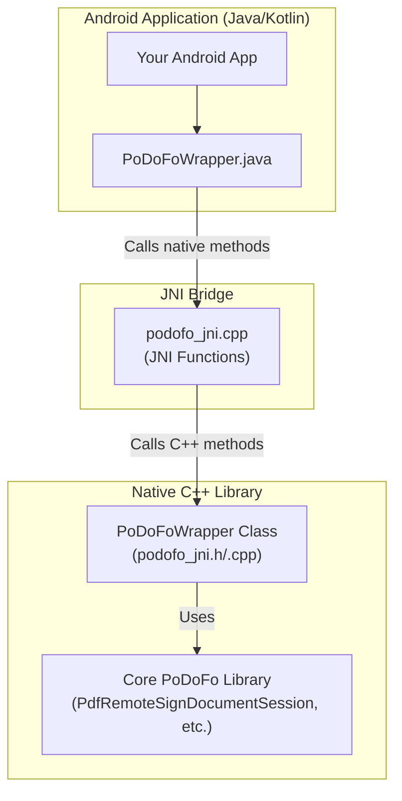
```mermaid
graph TD
    subgraph "Android Application (Java/Kotlin)"
        AndroidApp["Your Android App"] --> JavaWrapper["PoDoFoWrapper.java"]
    end

    subgraph "JNI Bridge"
        JavaWrapper -- "Calls native methods" --> JNI_Layer["podofo_jni.cpp<br>(JNI Functions)"]
    end

    subgraph "Native C++ Library"
        JNI_Layer -- "Calls C++ methods" --> CppWrapper["PoDoFoWrapper Class<br>(podofo_jni.h/.cpp)"]
        CppWrapper -- "Uses" --> CoreLib["Core PoDoFo Library<br>(PdfRemoteSignDocumentSession, etc.)"]
    end
```

*   **1. Java Wrapper (`PoDoFoWrapper.java`):** This is the public-facing API for Android developers. It's a standard Java class that an app instantiates and interacts with. It declares `native` methods that correspond to functions in the C++ library and handles loading the native `podofo` shared library.

*   **2. JNI Layer (`podofo_jni.cpp`):** This is the core of the bridge. It contains the C-style JNI functions that match the `native` declarations in the Java wrapper. Its primary responsibilities are:
    *   Translating data types between the Java world (e.g., `jstring`, `jobjectArray`) and the C++ world (`std::string`, `std::vector`).
    *   Managing the lifecycle of the native C++ object.
    *   Catching C++ exceptions and re-throwing them as Java exceptions.

*   **3. C++ Wrapper (`PoDoFoWrapper` C++ Class):** Defined in `podofo_jni.h` and `podofo_jni.cpp`, this class serves as a clean, object-oriented interface for the JNI layer. Instead of having the JNI functions interact directly with the complex core PoDoFo library, they call methods on this simpler C++ wrapper object. This class directly holds and manages the `PdfRemoteSignDocumentSession` instance.

### 2. How it Works: The Lifecycle of a Native Object

The connection between the Java object and the C++ object is maintained through a pointer, which is stored as a `long` in the Java class. This is a common and effective JNI pattern.

1.  **Initialization:** An Android app creates an instance of `PoDoFoWrapper.java`. Its constructor immediately calls the `nativeInit(...)` JNI function.
2.  **Native Object Creation:** Inside `podofo_jni.cpp`, the `Java_com_podofo_android_PoDoFoWrapper_nativeInit` function creates a C++ `PoDoFoWrapper` object on the heap using `new`.
3.  **Handle Passing:** The memory address of this new C++ object is `reinterpret_cast` to a `jlong` (a 64-bit integer) and returned to the Java side. This integer is stored in the `nativeHandle` member variable of the Java `PoDoFoWrapper` object.
4.  **Method Calls:** When the Android app calls a method like `calculateHash()` on the Java object, the Java object calls its corresponding `nativeCalculateHash(nativeHandle)` method, passing the handle back to the JNI layer.
5.  **Pointer Recovery:** The JNI function `Java_com_podofo_android_PoDoFoWrapper_nativeCalculateHash` receives the `jlong nativeHandle`, casts it back into a `PoDoFoWrapper*` pointer, and uses that pointer to call the actual C++ `calculateHash()` method.
6.  **Cleanup:** When the Java `close()` method is called (or `finalize()` is triggered by the garbage collector), it calls the `nativeCleanup(nativeHandle)` function. This function casts the handle back to a `PoDoFoWrapper*` pointer and calls `delete` on it, properly freeing the memory on the C++ heap and preventing memory leaks.

### 3. Tutorial: Adding a New Function to the Bridge

This tutorial demonstrates how to add a new function to the bridge. For this example, we will imagine we want to expose a (hypothetical) function from `PdfRemoteSignDocumentSession` called `getConformanceLevel()` that returns the current session's conformance level as a string.

#### Step 1: Add the Method to the C++ Wrapper (`podofo_jni.h` & `.cpp`)

First, expose the new functionality in the C++ `PoDoFoWrapper` class that the JNI layer interacts with.

1.  **Declare the new method in `src/wrapper/podofo_jni.h`:**
    ```cpp
    // In class PoDoFoWrapper
    public:
        // ... existing method declarations
        std::string getConformanceLevel();
    ```

2.  **Implement the method in `src/wrapper/podofo_jni.cpp`:** The implementation should call the corresponding method on the `nativeSession` object.
    ```cpp
    // In podofo_jni.cpp
    std::string PoDoFoWrapper::getConformanceLevel() {
        if (!nativeSession) {
            throw std::runtime_error("PoDoFo session is not initialized.");
        }
        // This is a hypothetical method for the example.
        // In a real scenario, you would call nativeSession->GetSomeProperty();
        return nativeSession->getConformanceLevelForCpp();
    }
    ```

#### Step 2: Create the JNI Glue Function (`podofo_jni.h` & `.cpp`)

Next, create the JNI function that Java will call.

1.  **Declare the JNI function prototype in `src/wrapper/podofo_jni.h`:** The function name must follow the `Java_packagename_ClassName_methodName` convention.
    ```cpp
    // Inside the extern "C" block
    extern "C" {
        // ... existing JNI exports
        JNIEXPORT jstring JNICALL Java_com_podofo_android_PoDoFoWrapper_nativeGetConformanceLevel(
            JNIEnv* env, jobject thiz, jlong nativeHandle);
    }
    ```

2.  **Implement the JNI function in `src/wrapper/podofo_jni.cpp`:** This function handles error checking, pointer casting, calling the C++ wrapper method, and converting the C++ `std::string` result back to a Java `jstring`.
    ```cpp
    // In podofo_jni.cpp, within the extern "C" block
    JNIEXPORT jstring JNICALL Java_com_podofo_android_PoDoFoWrapper_nativeGetConformanceLevel(
        JNIEnv* env, jobject thiz, jlong nativeHandle) {
        
        if (!nativeHandle) {
            throwJavaException(env, "Session not initialized");
            return nullptr;
        }

        try {
            auto* wrapper = reinterpret_cast<PoDoFoWrapper*>(nativeHandle);
            std::string level = wrapper->getConformanceLevel();
            return stringToJstring(env, level);
        } catch (const std::exception& e) {
            throwJavaException(env, e.what());
            return nullptr;
        }
    }
    ```

#### Step 3: Add the Method to the Java Wrapper (`PoDoFoWrapper.java`)

Finally, expose the new function to the Android application developer.

1.  **Declare the `native` method in `src/android/src/main/java/com/podofo/android/PoDoFoWrapper.java**:
    ```java
    // In PoDoFoWrapper.java
    // ... with other native method declarations
    private native String nativeGetConformanceLevel(long handle);
    ```

2.  **Create the public Java method that calls the native method:** This is the clean, public API that the app developer will use. It should perform a handle check and wrap the native call.
    ```java
    // In PoDoFoWrapper.java
    /**
     * Gets the conformance level configured for the current session.
     *
     * @return The conformance level as a string.
     * @throws PoDoFoException if the session is not initialized.
     */
    public String getConformanceLevel() throws PoDoFoException {
        if (nativeHandle == 0) {
            throw new PoDoFoException("Session not initialized");
        }
        return nativeGetConformanceLevel(nativeHandle);
    }
    ```
With these three steps, you have successfully bridged a new C++ function, making it available to be called from any Android application.

### 4. Data Type Conversion and Exception Handling

*   **Data Conversion:** The bridge already contains helper functions in `podofo_jni.cpp` for common conversions (e.g., `jstringToString`, `jstringArrayToVector`). If you need to pass more complex data (like byte arrays or custom objects), you will need to write new JNI helper functions to handle their conversion.

*   **Exception Handling:** The bridge has a robust exception handling mechanism. Any `std::exception` thrown on the C++ side is caught in the JNI function, which then calls `throwJavaException`. This helper function finds the `com.podofo.android.PoDoFoException` Java class and uses it to throw a new exception into the JVM. This ensures that C++ errors are properly propagated and can be handled with a standard `try-catch` block in Java/Kotlin.

---

## III. PoDoFo to iOS Bridge: A Developer's Guide

This chapter provides a guide to the bridge connecting the C++ PoDoFo library with the iOS ecosystem (Objective-C and Swift). It details the architecture and provides a step-by-step tutorial for developers who need to expose new C++ functions to their iOS applications.

### 1. Architecture Overview

The iOS bridge leverages the power of Objective-C++ to create a seamless connection between the native C++ library and the high-level iOS application code. This approach is highly efficient as it avoids the complexity of a separate C-style JNI layer.

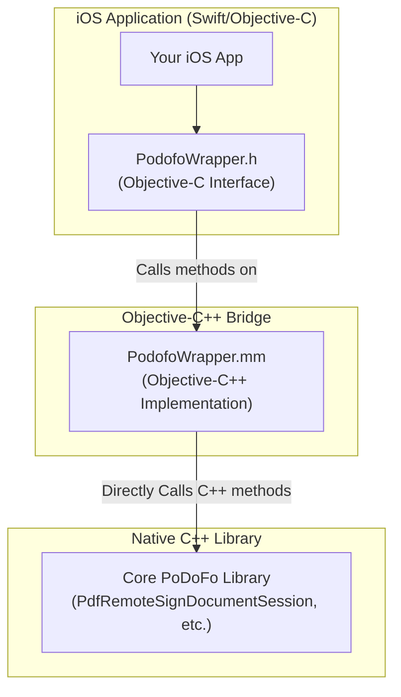
```mermaid
graph TD
    subgraph "iOS Application (Swift/Objective-C)"
        iOSApp["Your iOS App"] --> ObjCWrapper["PodofoWrapper.h<br>(Objective-C Interface)"]
    end

    subgraph "Objective-C++ Bridge"
        ObjCWrapper -- "Calls methods on" --> ObjCppImpl["PodofoWrapper.mm<br>(Objective-C++ Implementation)"]
    end

    subgraph "Native C++ Library"
        ObjCppImpl -- "Directly Calls C++ methods" --> CoreLib["Core PoDoFo Library<br>(PdfRemoteSignDocumentSession, etc.)"]
    end
```

*   **1. Objective-C Interface (`PodofoWrapper.h`):** This is the public API for iOS developers. It's a standard Objective-C header file that defines the `PodofoWrapper` class. Swift and Objective-C code will interact with this interface directly.

*   **2. Objective-C++ Implementation (`PodofoWrapper.mm`):** This is the core of the bridge. Because its extension is `.mm`, the compiler treats it as Objective-C++, a special "dialect" that can understand and mix both Objective-C and C++ syntax in the same file. This allows it to:
    *   Implement the Objective-C methods defined in the header.
    *   Directly instantiate and call methods on C++ objects (like `PoDoFo::PdfRemoteSignDocumentSession`).
    *   Translate data types between the Objective-C/Foundation world (`NSString`, `NSArray`) and the C++ standard library (`std::string`, `std::vector`).
    *   Catch C++ exceptions and convert them into native iOS `NSError` objects.

*   **3. Native C++ Library (`PdfRemoteSignDocumentSession`, etc.):** This is the core, platform-independent PoDoFo library. The Objective-C++ layer calls directly into this library without any additional wrappers.

### 2. How it Works: The Lifecycle of a Native Object

The connection is managed by directly embedding a C++ pointer as an instance variable within the Objective-C object.

1.  **Initialization:** An iOS app creates an instance of the `PodofoWrapper` Objective-C class using its custom `initWith...` initializer.
2.  **Native Object Creation:** Inside `PodofoWrapper.mm`, the `init...` method creates a C++ `PoDoFo::PdfRemoteSignDocumentSession` object on the heap using `new`.
3.  **Pointer Storage:** The memory address of this new C++ object is stored directly in the `_nativeSession` instance variable (a `PoDoFo::PdfRemoteSignDocumentSession*`).
4.  **Method Calls:** When the iOS app calls a method like `calculateHash` on the Objective-C object, the implementation in `PodofoWrapper.mm` directly calls the corresponding method on the C++ object via the `_nativeSession` pointer (e.g., `_nativeSession->beginSigning()`).
5.  **Cleanup:** The Objective-C object's `dealloc` method is implemented. When the Objective-C object is deallocated by the automatic reference counting (ARC) system, `dealloc` is called, which in turn calls `delete` on the `_nativeSession` pointer. This ensures the C++ object's memory is properly freed, preventing memory leaks.

### 3. Tutorial: Adding a New Function to the Bridge

Let's walk through adding a new function to expose a hypothetical `getHashAlgorithmOid()` method from `PdfRemoteSignDocumentSession`.

#### Step 1: Add the Method to the Objective-C Header (`PodofoWrapper.h`)

Define the new public method in the Objective-C interface so that it's visible to Swift and Objective-C consumers.

1.  **Declare the new method in `scripts/ios/podofo/PodofoWrapper.h`:**
    ```objc
    // In @interface PodofoWrapper
    /**
     * Gets the OID of the hash algorithm used for the session.
     *
     * @param error On input, a pointer to an error object.
     * @return The hash algorithm OID as a string, or nil if an error occurred.
     */
    - (nullable NSString *)getHashAlgorithmOid:(NSError **)error;
    ```
    *Note: We include an `(NSError **)` parameter for robust error handling, which is standard practice in Objective-C and bridges nicely to Swift's `throws` mechanism.*

#### Step 2: Implement the Method in Objective-C++ (`PodofoWrapper.mm`)

Implement the logic in the `.mm` file to bridge the call to the C++ library.

1.  **Implement the method in `scripts/ios/podofo/PodofoWrapper.mm`:**
    ```objc
    // In @implementation PodofoWrapper

    - (nullable NSString *)getHashAlgorithmOid:(NSError **)error {
        if (_nativeSession == NULL) {
            if (error) {
                *error = [NSError errorWithDomain:PodofoSignerErrorDomain
                                             code:101 // Or some other meaningful code
                                         userInfo:@{NSLocalizedDescriptionKey: @"Session not initialized"}];
            }
            return nil;
        }

        try {
            // This is a hypothetical C++ method for the example.
            std::string oidStr = _nativeSession->getHashAlgorithmOid();
            return [NSString stringWithUTF8String:oidStr.c_str()];
        } catch (const std::exception& e) {
            if (error) {
                *error = [NSError errorWithDomain:PodofoSignerErrorDomain
                                             code:102
                                         userInfo:@{NSLocalizedDescriptionKey: [NSString stringWithUTF8String:e.what()]}];
            }
            return nil;
        }
    }
    ```

With these two steps, the new function is fully exposed to the iOS application layer. A Swift developer could now call it like this:

```swift
do {
    let oid = try podofoWrapper.getHashAlgorithmOid()
    print("Hash OID: \(oid)")
} catch {
    print("An error occurred: \(error.localizedDescription)")
}
```

### 4. Data Type Conversion and Error Handling

*   **Data Conversion:** The bridge relies on manual conversion between Foundation types and C++ standard library types. For example, `[nsString UTF8String]` converts an `NSString` to a `const char*` which can be used to construct a `std::string`, and `[NSString stringWithUTF8String:stdString.c_str()]` does the reverse. Similarly, `for` loops are used to convert between `NSArray` and `std::vector`.

*   **Error Handling:** The bridge uses a standard and effective pattern for error handling. C++ code that can fail is wrapped in a `try...catch` block. If a `std::exception` is caught, its `what()` message is used to construct a new `NSError` object, which is then passed back to the caller through the `error` parameter. This makes C++ exceptions behave like native iOS errors.

---

## IV. CI/CD: The Build & Release Workflows

This chapter details the Continuous Integration and Continuous Deployment (CI/CD) pipelines used to build, test, and release the PoDoFo library for Android and iOS. These workflows are defined using GitHub Actions and can be found in the `.github/workflows/` directory.

### 1. Overview

The CI/CD strategy is designed to automate the complex process of compiling the native C++ PoDoFo library and its numerous dependencies for mobile platforms.

*   **Triggering:** The build workflows (`build-android-podofo.yaml`, `build-ios-podofo.yaml`) are triggered on every `push` and `pull_request` to the repository, ensuring that all changes are continuously validated. They can also be triggered manually.
*   **Dependency Management:** The workflows build each C++ dependency (like OpenSSL, Freetype, etc.) from the source for each platform. The results of these builds are cached and stored as artifacts to speed up subsequent runs.
*   **Platform-Specific Builds:** Each mobile platform has its own dedicated build workflow that handles the specific toolchains and architectures required (Android NDK for Android, Xcode for iOS).
*   **Release Automation:** The `release-android-podofo.yaml` workflow is triggered automatically when a new release is published on GitHub, automating the process of deploying the final Android library (AAR) to a package repository.

### 2. Android Workflow Breakdown (`build-android-podofo.yaml`)

This workflow is responsible for creating a universal Android Archive (AAR) that contains the PoDoFo library and its JNI bridge.

#### **Job 1: Build Dependencies**
*   **Description:** A series of parallel jobs (`build-android-brotli`, `build-android-bzip2`, `build-android-freetype`, etc.) are run to compile each of the external C++ libraries required by PoDoFo.
*   **Process:**
    1.  Each job checks out the specific version of the dependency's source code.
    2.  It sets up the Android NDK using the `nttld/setup-ndk` action.
    3.  It executes a platform-specific build script (e.g., `scripts/android/openssl/build.sh`) to cross-compile the dependency for Android.
    4.  The compiled library is cached and uploaded as a build artifact to be used in later jobs.

#### **Job 2: Build PoDoFo (`build-android-podofo`)**
*   **Description:** This job compiles the core PoDoFo C++ library for all required Android architectures.
*   **Process:**
    1.  It uses a `matrix` strategy to run the build for multiple architectures (`arm64-v8a`, `armeabi-v7a`, `x86`, `x86_64`).
    2.  It downloads all the dependency artifacts built in the previous stage.
    3.  It executes the `scripts/android/podofo/build.sh` script, which uses CMake and the Android NDK to build the PoDoFo library for the specific architecture.
    4.  The resulting compiled library for each architecture is uploaded as an artifact.

#### **Job 3: Publish AAR (`publish-android-podofo-aar`)**
*   **Description:** This final job assembles all the compiled libraries into a single, distributable AAR file.
*   **Process:**
    1.  It downloads all the compiled dependency artifacts and the multi-architecture PoDoFo artifacts.
    2.  It runs the `organize_libs.sh` script to arrange all the `.a` (static library) files into the correct directory structure.
    3.  It runs the `scripts/android/podofo-aar/build.sh` script to build the JNI bridge (`podofo_jni.cpp`) against the native libraries.
    4.  The compiled JNI `.so` (shared library) files are copied into the `src/android/src/main/jniLibs` directory.
    5.  It sets up a Java environment and uses Gradle (`./gradlew build`) to package the Java wrapper, native `.so` files, and all other resources into the final AAR.
    6.  The generated AAR is uploaded as a workflow artifact.

### 3. iOS Workflow Breakdown (`build-ios-podofo.yaml`)

This workflow is responsible for creating a universal `PoDoFo.xcframework` that can be easily integrated into any iOS project.

#### **Job 1: Build Dependencies**
*   **Description:** Similar to the Android workflow, a series of jobs (`build-ios-freetype`, `build-ios-openssl`, etc.) run in parallel to compile the C++ dependencies.
*   **Process:**
    1.  Each job runs on a `macos-latest` runner.
    2.  It downloads the source code for the specific dependency.
    3.  It executes a platform-specific build script (e.g., `scripts/ios/freetype/build.sh`), which handles the complexity of building for multiple iOS architectures (simulator and device) and creating universal binaries.
    4.  The compiled dependency is cached and uploaded as an artifact.

#### **Job 2: Build PoDoFo (`build-ios-podofo`)**
*   **Description:** This job compiles the core PoDoFo library and the Objective-C++ wrapper into a single `XCFramework`.
*   **Process:**
    1.  It downloads all the compiled dependency artifacts.
    2.  It executes the main build script, `scripts/ios/podofo/build.sh`. This script uses CMake and the iOS toolchain to:
        *   Compile PoDoFo for all necessary iOS architectures.
        *   Compile the Objective-C++ wrapper (`PodofoWrapper.mm`).
        *   Combine the compiled binaries into a universal `PoDoFo.xcframework`.
    3.  The final `PoDoFo.xcframework` is uploaded as an artifact.

#### **Job 3: Publish Swift Package (`publish-swift-package`)**
*   **Description:** This job, which runs only on pushes to the `main` branch, automatically updates the repository to make the `XCFramework` available as a Swift Package.
*   **Process:**
    1.  It downloads the `PoDoFo.xcframework` artifact.
    2.  It copies the framework into the `ios-package/` directory.
    3.  It generates a `Package.swift` file that defines the Swift Package and points to the binary framework.
    4.  It commits and pushes the updated framework and `Package.swift` file back to the repository.

### 4. Android Release Workflow (`release-android-podofo.yaml`)

This workflow is nearly identical to `build-android-podofo.yaml`, but with a different trigger and a final deployment step.

*   **Trigger:** This workflow runs when a new release is published in the GitHub repository (`on: release: types: [released]`).
*   **Final Step: Publish to Sonatype:** After the AAR is successfully built, a final step is executed. It uses Gradle (`./gradlew publishAllPublicationsToMavenCentral`) to publish the AAR to the Sonatype Maven repository, making it available for developers to use as a standard Gradle dependency. This step uses secrets (`OSSRH_GPG_KEY_ID`, `OSSRH_USERNAME`, etc.) to authenticate with the repository.

### 5. iOS Release Workflow

*   **iOS Build Workflow (`build-ios-podofo.yaml`):** This workflow is triggered on pushes to `main` or pull requests. It builds the PoDoFo library for all target iOS architectures (simulator and device) and packages them into a single `PoDoFo.xcframework`. The resulting framework is then uploaded as a build artifact.

*   **iOS Release Workflow:** While not explicitly detailed, a release workflow for iOS would typically follow the build, taking the `PoDoFo.xcframework` artifact, creating a new GitHub release, and uploading the framework as a release asset.

---

## V. EUDI Wallet Swift Library: A Developer's Guide

This chapter provides a developer-focused guide to the EUDI Wallet Swift library, which acts as a client for the Cloud Signature Consortium (CSC) API and integrates the PoDoFo C++ library to perform PAdES-compliant remote signing on iOS.

### 1. Architecture Overview

The Swift library is architected with a clear separation of concerns, providing a high-level facade for application developers while encapsulating the complexity of CSC API communication, cryptographic operations, and interaction with the native PoDoFo library.

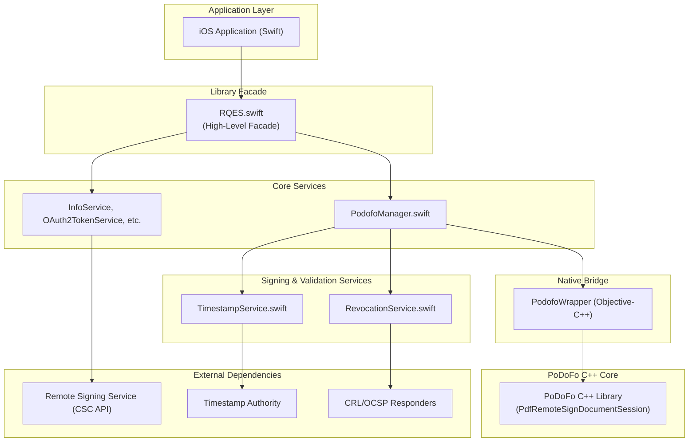
```mermaid
graph TD
    subgraph "Application Layer"
        App["iOS Application (Swift)"]
    end

    subgraph "Library Facade"
        RQES["RQES.swift<br>(High-Level Facade)"]
    end

    subgraph "Core Services"
        CSCServices["InfoService, OAuth2TokenService, etc."]
        PodofoManager["PodofoManager.swift"]
    end

    subgraph "Signing & Validation Services"
        TimestampService["TimestampService.swift"]
        RevocationService["RevocationService.swift"]
    end
    
    subgraph "Native Bridge"
        PodofoWrapper["PodofoWrapper (Objective-C++)"]
    end

    subgraph "PoDoFo C++ Core"
        PoDoFoCore["PoDoFo C++ Library<br>(PdfRemoteSignDocumentSession)"]
    end

    subgraph "External Dependencies"
        RemoteSigner["Remote Signing Service (CSC API)"]
        TSA["Timestamp Authority"]
        RevocationEndpoints["CRL/OCSP Responders"]
    end

    App --> RQES
    RQES --> CSCServices
    RQES --> PodofoManager
    CSCServices --> RemoteSigner

    PodofoManager --> TimestampService
    PodofoManager --> RevocationService
    PodofoManager --> PodofoWrapper

    TimestampService --> TSA
    RevocationService --> RevocationEndpoints

    PodofoWrapper --> PoDoFoCore
```

*   **`RQES.swift` (Facade):** The primary entry point for the library. It orchestrates the entire workflow, from service discovery and authorization to document signing.
*   **Core Services:** A set of services responsible for interacting with the CSC API endpoints (e.g., `InfoService`, `OAuth2TokenService`, `CredentialsListService`, `SignHashService`).
*   **`PodofoManager.swift`:** An actor that manages the interaction with the underlying PoDoFo C++ library via the Objective-C++ bridge. It is responsible for the PAdES-specific workflows.
*   **Signing & Validation Services:** Specialized services (`TimestampService`, `RevocationService`) used by `PodofoManager` to gather the necessary data for PAdES B-T, B-LT, and B-LTA signatures.
*   **Native Bridge (`PodofoWrapper`):** The Objective-C++ bridge that exposes the functionality of `PdfRemoteSignDocumentSession` to the Swift environment.

### 2. `RQES`: The High-Level Facade

The `RQES` class is designed to be the single point of interaction for a client application. It abstracts the entire remote signing flow into a series of logical, asynchronous methods.

A typical signing workflow involves calling the `RQES` methods in the following sequence:

1.  **`prepareServiceAuthorizationRequest(...)`**: Kicks off the authorization flow by getting the OAuth2 provider's metadata from the CSC info endpoint.
2.  **`requestAccessTokenAuthFlow(...)`**: Handles the OAuth2 token exchange to acquire an access token for the session.
3.  **`listCredentials(...)`**: Fetches a list of available signing credentials for the authorized user.
4.  **`getCredentialInfo(...)`**: Retrieves detailed information about a specific credential, including the public key certificate chain required for signing.
5.  **`calculateDocumentHashes(...)`**: This is the first step of the two-phase signing process. The client provides the documents to be signed, and this method uses `PodofoManager` to call the native PoDoFo library, which prepares the PDF and calculates the cryptographic hash that needs to be signed.
6.  **`signHash(...)`**: The client sends the hashes obtained in the previous step to the CSC remote signing service. This method handles the `signatures/signHash` API call, returning the remotely computed signature.
7.  **`createSignedDocuments(...)`**: In the final step, the client provides the remote signatures to this method. It again uses `PodofoManager` to inject the signatures into the PDFs, add timestamps and LTV data as required by the conformance level, and finalize the documents.

### 3. `PodofoManager`: Orchestrating the Signing Process

The `PodofoManager` is a Swift actor that serves as a high-level wrapper around the `PodofoWrapper` bridge. It manages the state of signing sessions and orchestrates the complex PAdES workflows.

*   **State Management:** It maintains an array of `PodofoSession` objects. Each session corresponds to a single document being signed and holds the native `PodofoWrapper` instance, certificates, and conformance level.
*   **`calculateDocumentHashes(...)`:**
    *   For each document, it initializes a `PodofoWrapper` instance, configuring it with the specified conformance level, hash algorithm, certificates, and file paths.
    *   It creates a `PodofoSession` to track the state.
    *   It calls the bridged `calculateHash()` method, which triggers the `beginSigning()` logic in the native C++ `PdfRemoteSignDocumentSession`.
    *   It collects and returns the hashes for all documents.
*   **`createSignedDocuments(...)`:**
    *   It ensures the number of provided signatures matches the number of active sessions.
    *   It iterates through each session and delegates to the appropriate `handleAdes...` method based on the session's conformance level.

### 4. PAdES Conformance Level Workflows in Swift

`PodofoManager` implements the client-side logic required for each PAdES level, demonstrating the division of responsibilities between the client (Swift library) and the core signing engine (PoDoFo C++). The process is split into two main phases orchestrated by the `RQES` facade:
1.  **`calculateDocumentHashes(...)`**: This phase prepares the PDF document, creates a signature placeholder, and calculates the cryptographic hash of its contents. This corresponds to the `beginSigning` operation in the native PoDoFo library.
2.  **`createSignedDocuments(...)`**: This phase takes the remotely signed hash, gathers necessary validation data (timestamps, CRLs, etc.), and injects the final signature into the document. This corresponds to the `finishSigning` operation.

The following sections detail the end-to-end flow for each conformance level.

#### PAdES B-B

This is the most straightforward flow, involving only the hash calculation and signature embedding steps.

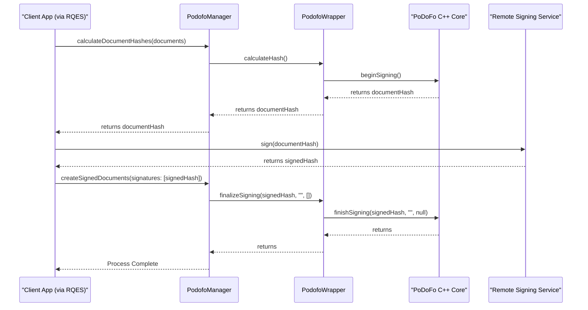
```mermaid
sequenceDiagram
    participant App as "Client App (via RQES)"
    participant Manager as PodofoManager
    participant Wrapper as PodofoWrapper
    participant Core as "PoDoFo C++ Core"
    participant RemoteSigner as "Remote Signing Service"

    App->>Manager: calculateDocumentHashes(documents)
    Manager->>Wrapper: calculateHash()
    Wrapper->>Core: beginSigning()
    Core-->>Wrapper: returns documentHash
    Wrapper-->>Manager: returns documentHash
    Manager-->>App: returns documentHash

    App->>RemoteSigner: sign(documentHash)
    RemoteSigner-->>App: returns signedHash

    App->>Manager: createSignedDocuments(signatures: [signedHash])
    Manager->>Wrapper: finalizeSigning(signedHash, "", [])
    Wrapper->>Core: finishSigning(signedHash, "", null)
    Core-->>Wrapper: returns
    Wrapper-->>Manager: returns
    Manager-->>App: Process Complete
```
**Flow Description:**
1.  **Get Hash:** The app calls `calculateDocumentHashes`. The `PodofoManager` calls the wrapper's `calculateHash()` method, which in turn calls the native `beginSigning()` function. This prepares the PDF and returns the `documentHash`.
2.  **Sign Hash:** The application sends the `documentHash` to the remote signing service and receives the `signedHash`.
3.  **Embed Signature:** The app calls `createSignedDocuments`. The `PodofoManager` calls `finalizeSigning` on the `PodofoWrapper`, passing the `signedHash`. The wrapper bridges this to the C++ `finishSigning` method, which embeds the signature into the PDF.

---

#### PAdES B-T

This flow adds the step of acquiring a trusted timestamp for the signature after it has been remotely signed.

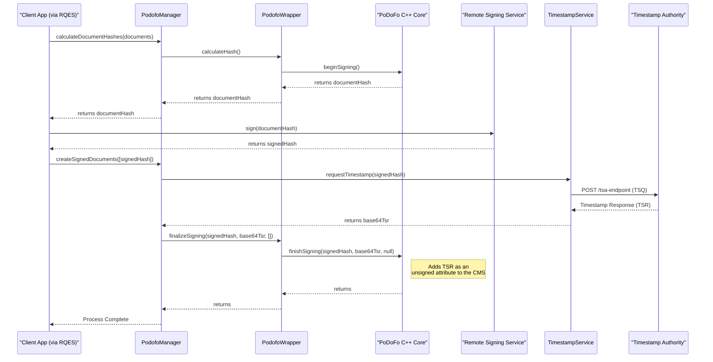
```mermaid
sequenceDiagram
    participant App as "Client App (via RQES)"
    participant Manager as PodofoManager
    participant Wrapper as PodofoWrapper
    participant Core as "PoDoFo C++ Core"
    participant RemoteSigner as "Remote Signing Service"
    participant TimestampSvc as TimestampService
    participant TSA as "Timestamp Authority"

    App->>Manager: calculateDocumentHashes(documents)
    Manager->>Wrapper: calculateHash()
    Wrapper->>Core: beginSigning()
    Core-->>Wrapper: returns documentHash
    Wrapper-->>Manager: returns documentHash
    Manager-->>App: returns documentHash
    
    App->>RemoteSigner: sign(documentHash)
    RemoteSigner-->>App: returns signedHash

    App->>Manager: createSignedDocuments([signedHash])
    Manager->>TimestampSvc: requestTimestamp(signedHash)
    TimestampSvc->>TSA: POST /tsa-endpoint (TSQ)
    TSA-->>TimestampSvc: Timestamp Response (TSR)
    TimestampSvc-->>Manager: returns base64Tsr

    Manager->>Wrapper: finalizeSigning(signedHash, base64Tsr, [])
    Wrapper->>Core: finishSigning(signedHash, base64Tsr, null)
    note right of Core: Adds TSR as an<br/>unsigned attribute to the CMS
    Core-->>Wrapper: returns
    Wrapper-->>Manager: returns
    Manager-->>App: Process Complete
```
**Flow Description:**
1.  **Get Hash:** The app calls `calculateDocumentHashes`. `PodofoManager` calls the wrapper's `calculateHash()` method, which in turn calls the native `beginSigning()` function to get the `documentHash`.
2.  **Sign Hash:** The application sends the `documentHash` to the remote signing service and receives the `signedHash`.
3.  **Request Timestamp:** The app calls `createSignedDocuments`. `PodofoManager` first calls `requestTimestamp` on the `TimestampService`, passing the `signedHash`.
4.  **Finalize with Timestamp:** Upon receiving the timestamp response (TSR), `PodofoManager` calls `finalizeSigning`, providing both the `signedHash` and the Base64-encoded TSR.

---

#### PAdES B-LT

This flow builds on B-T by gathering and embedding all necessary long-term validation (LTV) data.

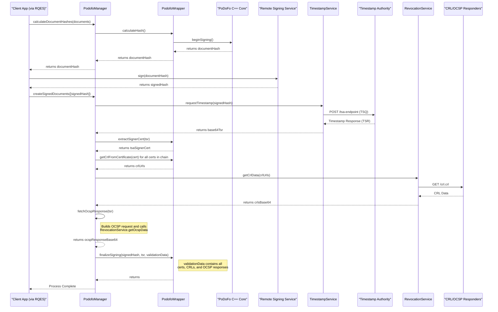
```mermaid
sequenceDiagram
    participant App as "Client App (via RQES)"
    participant Manager as PodofoManager
    participant Wrapper as PodofoWrapper
    participant Core as "PoDoFo C++ Core"
    participant RemoteSigner as "Remote Signing Service"
    participant TimestampSvc as TimestampService
    participant TSA as "Timestamp Authority"
    participant RevocationSvc as RevocationService
    participant Endpoints as "CRL/OCSP Responders"

    App->>Manager: calculateDocumentHashes(documents)
    Manager->>Wrapper: calculateHash()
    Wrapper->>Core: beginSigning()
    Core-->>Wrapper: returns documentHash
    Wrapper-->>Manager: returns documentHash
    Manager-->>App: returns documentHash
    
    App->>RemoteSigner: sign(documentHash)
    RemoteSigner-->>App: returns signedHash

    App->>Manager: createSignedDocuments([signedHash])
    Manager->>TimestampSvc: requestTimestamp(signedHash)
    TimestampSvc->>TSA: POST /tsa-endpoint (TSQ)
    TSA-->>TimestampSvc: Timestamp Response (TSR)
    TimestampSvc-->>Manager: returns base64Tsr

    Manager->>Wrapper: extractSignerCert(tsr)
    Wrapper-->>Manager: returns tsaSignerCert

    Manager->>Wrapper: getCrlFromCertificate(cert) for all certs in chain
    Wrapper-->>Manager: returns crlUrls
    Manager->>RevocationSvc: getCrlData(crlUrls)
    RevocationSvc->>Endpoints: GET /crl.crl
    Endpoints-->>RevocationSvc: CRL Data
    RevocationSvc-->>Manager: returns crlsBase64

    Manager->>Manager: fetchOcspResponse(tsr)
    note right of Manager: Builds OCSP request and calls<br/>RevocationService.getOcspData
    Manager-->>Manager: returns ocspResponseBase64
    
    Manager->>Wrapper: finalizeSigning(signedHash, tsr, validationData)
    note right of Wrapper: validationData contains all<br/>certs, CRLs, and OCSP responses
    Wrapper-->>Manager: returns
    Manager-->>App: Process Complete
```
**Flow Description:**
1.  **B-T Flow:** The process starts by completing the `calculateDocumentHashes` and `signHash` steps, and then inside `createSignedDocuments` it performs the B-T flow to obtain the `timestampResponse`.
2.  **Gather LTV Data:** Before finalizing, the manager gathers all validation data:
    *   **Certificates:** It assembles a list of all certificates (signer's chain and TSA's chain).
    *   **CRLs:** It extracts CRL distribution point URLs from the certificates (using `PodofoWrapper` helpers) and fetches the CRL data via the `RevocationService`.
    *   **OCSP:** It uses its internal `fetchOcspResponse` method to build and send an OCSP request for the TSA's certificate, including the fallback logic to fetch a missing issuer certificate.
3.  **Finalize with LTV:** `PodofoManager` calls `finalizeSigning`, passing the `signedHash`, the TSR, and the fully populated `ValidationData` object to the wrapper.

---

#### PAdES B-LTA

This flow applies a final, overarching document timestamp after the entire B-LT flow is complete.

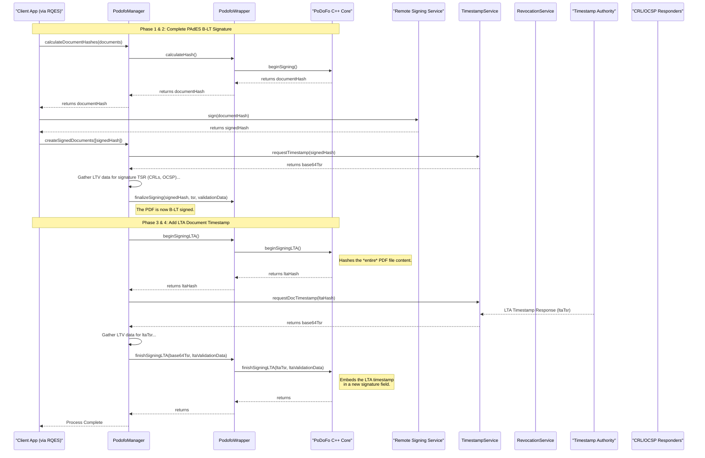
```mermaid
sequenceDiagram
    participant App as "Client App (via RQES)"
    participant Manager as PodofoManager
    participant Wrapper as PodofoWrapper
    participant Core as "PoDoFo C++ Core"
    participant RemoteSigner as "Remote Signing Service"
    participant TimestampSvc as TimestampService
    participant RevocationSvc as RevocationService
    participant TSA as "Timestamp Authority"
    participant Endpoints as "CRL/OCSP Responders"

    note over App, Core: Phase 1 & 2: Complete PAdES B-LT Signature
    App->>Manager: calculateDocumentHashes(documents)
    Manager->>Wrapper: calculateHash()
    Wrapper->>Core: beginSigning()
    Core-->>Wrapper: returns documentHash
    Wrapper-->>Manager: returns documentHash
    Manager-->>App: returns documentHash
    
    App->>RemoteSigner: sign(documentHash)
    RemoteSigner-->>App: returns signedHash

    App->>Manager: createSignedDocuments([signedHash])
    Manager->>TimestampSvc: requestTimestamp(signedHash)
    TimestampSvc-->>Manager: returns base64Tsr

    Manager->>Manager: Gather LTV data for signature TSR (CRLs, OCSP)...
    
    Manager->>Wrapper: finalizeSigning(signedHash, tsr, validationData)
    note right of Manager: The PDF is now B-LT signed.

    note over App, Core: Phase 3 & 4: Add LTA Document Timestamp
    Manager->>Wrapper: beginSigningLTA()
    Wrapper->>Core: beginSigningLTA()
    note right of Core: Hashes the *entire* PDF file content.
    Core-->>Wrapper: returns ltaHash
    Wrapper-->>Manager: returns ltaHash

    Manager->>TimestampSvc: requestDocTimestamp(ltaHash)
    TSA-->>TimestampSvc: LTA Timestamp Response (ltaTsr)
    TimestampSvc-->>Manager: returns base64Tsr

    Manager->>Manager: Gather LTV data for ltaTsr...

    Manager->>Wrapper: finishSigningLTA(base64Tsr, ltaValidationData)
    Wrapper->>Core: finishSigningLTA(ltaTsr, ltaValidationData)
    note right of Core: Embeds the LTA timestamp<br/>in a new signature field.
    Core-->>Wrapper: returns
    Wrapper-->>Manager: returns
    Manager-->>App: Process Complete
```
**Flow Description:**
1.  **Complete B-LT:** The entire PAdES B-LT process (`calculateDocumentHashes` and `createSignedDocuments`) must be completed first.
2.  **Get LTA Hash:** Inside the `handleAdesB_LTA` method, `PodofoManager` calls `beginSigningLTA()` on the wrapper. This triggers a new hash calculation over the *entire B-LT signed file*.
3.  **Get LTA Timestamp:** The returned `ltaHash` is sent to the `TimestampService` to get a document-level timestamp.
4.  **Gather LTA Validation Data:** The manager gathers CRL/OCSP data for the LTA timestamp's TSA certificate.
5.  **Finalize LTA:** `PodofoManager` calls `finishSigningLTA()`, providing the new LTA timestamp and its validation data to be embedded in a second signature field, completing the archival process.

### 5. Core Services and Utilities

The library includes several specialized components to support the `PodofoManager`.

*   **`TimestampService` & `TimestampUtils`**: `TimestampUtils` provides static methods (`buildTSQ`, `buildTSQForDocTimeStamp`) to construct ASN.1-encoded Time-Stamp Query (TSQ) requests according to RFC3161. The `TimestampService` uses this utility to create the request body, which it then sends to the TSA via the `TimestampClient`.

*   **`RevocationService`**: This actor is a facade over the `CrlClient`, `OcspClient`, and `CertificateClient`. It provides a clean API for `PodofoManager` to fetch the various artifacts needed for LTV data by simply providing the necessary URLs or request objects.

*   **Networking Layer**: The low-level `CrlClient`, `OcspClient`, `TimestampClient`, and `CertificateClient` classes encapsulate the direct network communication for their respective operations, handling HTTP GET and POST requests and processing the binary responses.

---

## VI. iOS Tester App: A User Guide

### 1. Introduction

This chapter provides a user guide for the iOS Tester App, a sample application designed to demonstrate a real-world implementation of the `RQES` Swift library. The app allows developers to perform a complete end-to-end PAdES remote signing flow, from user authentication to the creation of a signed PDF document.

The core logic is driven by `RQESViewModel.swift`, which showcases how to orchestrate the calls to the `RQES` facade to interact with the CSC API.

### 2. The Signing Flow Step-by-Step

This section walks through the user journey for signing a document with the app, using Postman to handle the authorization code flow.

#### **Prerequisite: Configure Postman**

Before you begin, you must configure Postman to *not* automatically follow redirects. This is the key to being able to inspect the `Location` header and extract the authorization code.

1.  Go to Postman's settings (File > Settings).
2.  Under the **General** tab, find the **Headers** section.
3.  Ensure the **"Automatically follow redirects"** option is **turned OFF**.


#### **Step 1: Configuration**

Before starting, configure the signing process on the app's main screen.

*   **Select Conformance Level:** Choose the desired PAdES level (e.g., `ADES-B-LTA`).
*   **Select TSA URL:** Choose a Timestamp Authority.

Tap **"Start Flow"** to begin.

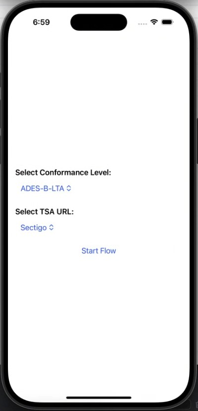

#### **Step 2: Service Authorization**

This phase involves getting the first authorization code required to fetch the user's credentials.

1.  **Copy the Service URL:** The app generates and displays the Service Authorization URL. Tap **"Copy URL"**.

    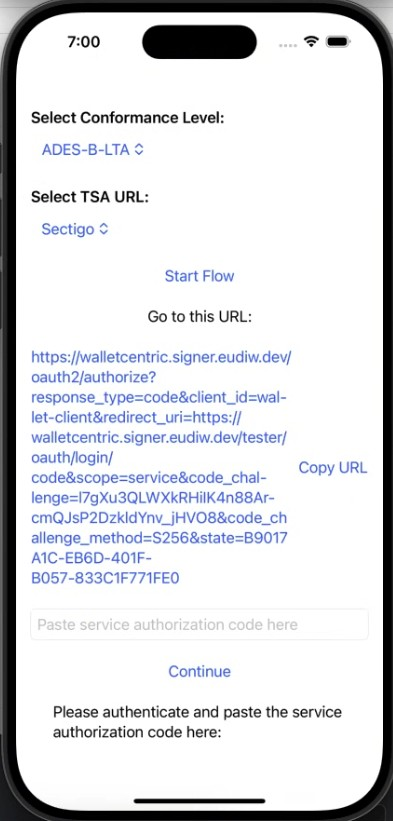

2.  **Make Initial Postman Request:** In Postman, paste the URL into a new `GET` request and send it. The server will respond with a `302 Found` redirect to a login page.

    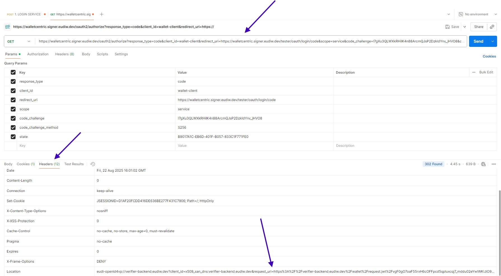

3.  **Authenticate in Postman:** Using the login URL from the previous step, create a `POST` request in Postman. Provide your user credentials in the body. Sending this request will authenticate you and return a session cookie (`JSESSIONID`).

    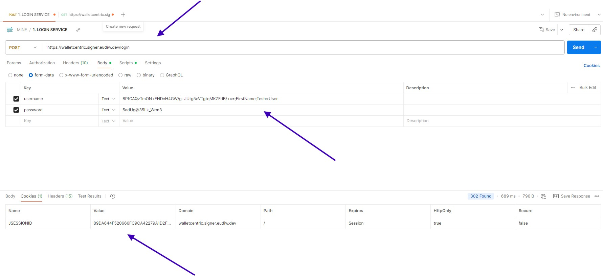

4.  **Re-run Request to Get Code:** Go back to the original `GET` request (from step 2) and re-run it. Because Postman now has the session cookie, the server will authenticate you and respond with another `302 Found` redirect. This time, the `Location` header will contain the authorization **code**.

    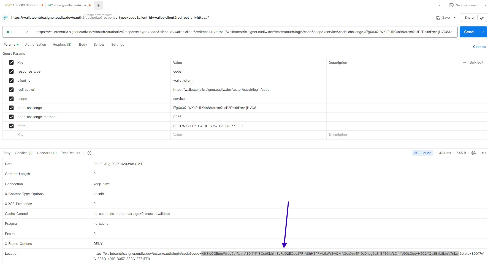

5.  **Submit Service Code:** Copy the code from the `Location` header, paste it into the app's "Paste service authorization code here" field, and tap **"Continue"**.

    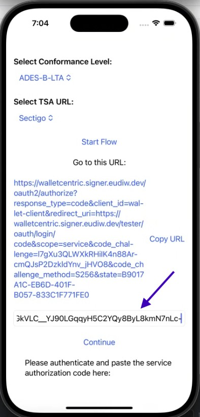

#### **Step 3: Credential Authorization**

After submitting the first code, the app fetches credential details, calculates the document hash, and immediately prepares for the second authorization step, which is required to approve the signing itself.

1.  **Copy the Credential URL:** The app generates a new Credential Authorization URL. Tap **"Copy URL"**.

    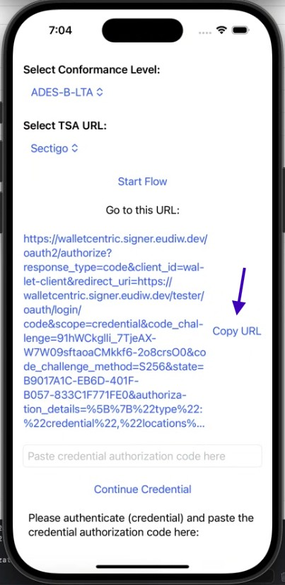

2.  **Make Postman Requests:** Repeat the same Postman flow as in Step 2:
    *   Make a `GET` request with the new URL to get the redirect. (`image 8.jpg`)
    *   Ensure you are logged in (the session cookie should still be valid, but you can re-run the login request if needed). (`image 9.jpg`)
    *   Re-run the `GET` request to receive the redirect containing the **credential code** in the `Location` header. (`image 10.jpg`)

    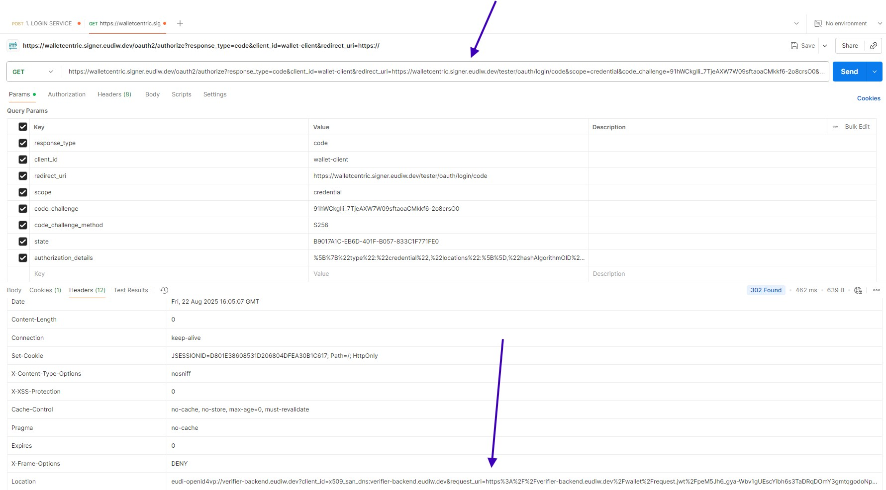
    
    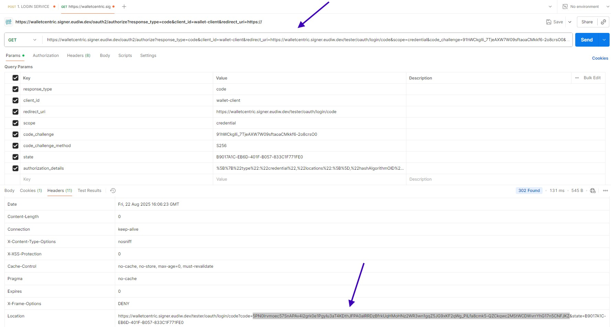

3.  **Submit Credential Code:** Copy the new code, paste it into the app's "Paste credential authorization code here" field, and tap **"Continue Credential"**.

    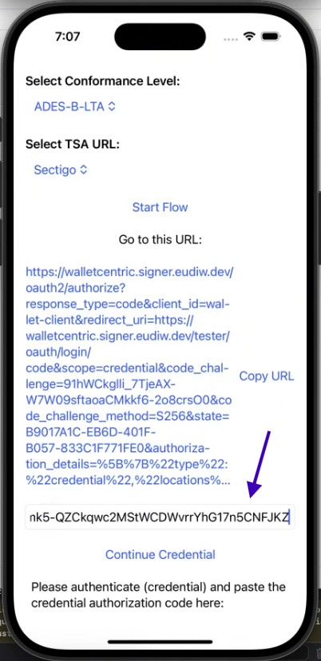

#### **Step 4: Completion**

Upon submitting the final code, the app performs the remaining actions: it gets the signing access token, sends the hash for signing, and builds the final PAdES-compliant PDF. A success message confirms the process is complete.

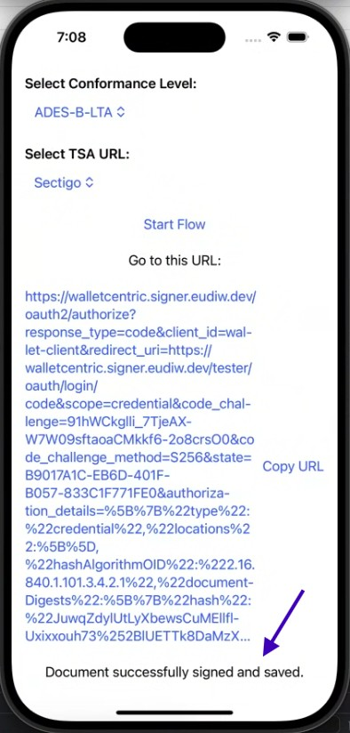

#### **Step 5: Verifying the Signature**

The final signed document (`sample-signed.pdf`) is saved in the app's document directory. When opened in a PDF reader like Adobe Acrobat, the signature panel will show the valid signatures. For a B-LTA signature, this will include the user's signature and a second signature from the Timestamp Authority, confirming the long-term archival status.

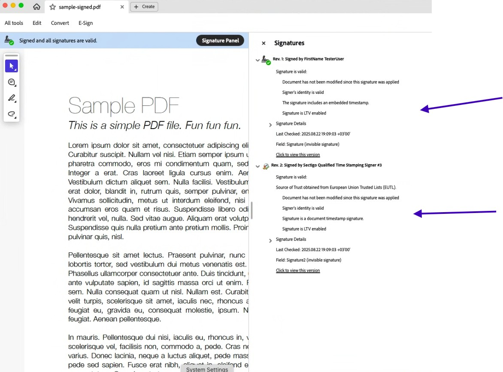

### 3. Behind the Scenes: `RQESViewModel.swift`

The `RQESViewModel.swift` class orchestrates this entire process by calling the `RQES` library functions in the correct sequence.

*   **`startFlow()`:** This function, triggered by the "Start Flow" button, makes the initial call to `rqes.prepareServiceAuthorizationRequest(...)` to get the first URL.
*   **`submitServiceCode()`:** This function calls `continueWithCode()`, which orchestrates the complex middle part of the flow:
    1.  `rqes.requestAccessTokenAuthFlow(...)` to get the first token.
    2.  `rqes.listCredentials(...)` and `rqes.getCredentialInfo(...)` to get certificate details.
    3.  `rqes.calculateDocumentHashes(...)` to prepare the PDF and get the hash.
    4.  `rqes.prepareCredentialAuthorizationRequest(...)` to get the second URL.
*   **`submitCredentialCode()`:** This function calls `continueWithCredentialCode()`, which performs the final steps:
    1.  `rqes.requestAccessTokenAuthFlow(...)` again, this time with the credential code, to get the signing token.
    2.  `rqes.signHash(...)` to get the remote signature.
    3.  `rqes.createSignedDocuments(...)` to finalize the PDF.

This ViewModel serves as a practical, step-by-step example of how to integrate the `RQES` library into a real iOS application.

---

## VII. EUDI Wallet Kotlin Library: A Developer's Guide

This chapter provides a developer-focused guide to the EUDi Wallet Kotlin library, which serves as a client for the Cloud Signature Consortium (CSC) API and integrates with the PoDoFo C++ library (via a JNI bridge) to perform PAdES-compliant remote signing on Android.

### 1. Architecture Overview

The Kotlin library mirrors the architecture of its Swift counterpart, emphasizing a clean separation of concerns. It provides a high-level facade for Android developers while managing the complexities of CSC API interactions, cryptographic tasks, and communication with the native PoDoFo layer.

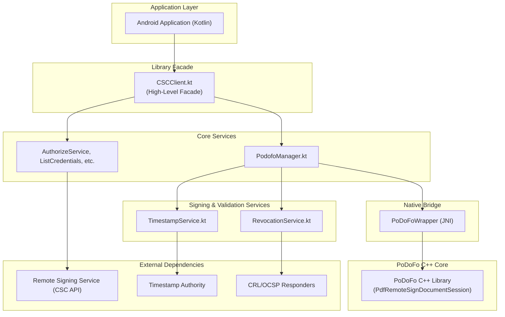
```mermaid
graph TD
    subgraph "Application Layer"
        App["Android Application (Kotlin)"]
    end

    subgraph "Library Facade"
        CSCClient["CSCClient.kt<br>(High-Level Facade)"]
    end

    subgraph "Core Services"
        CSCServices["AuthorizeService, ListCredentials, etc."]
        PodofoManager["PodofoManager.kt"]
    end

    subgraph "Signing & Validation Services"
        TimestampService["TimestampService.kt"]
        RevocationService["RevocationService.kt"]
    end
    
    subgraph "Native Bridge"
        PodofoWrapper["PoDoFoWrapper (JNI)"]
    end

    subgraph "PoDoFo C++ Core"
        PoDoFoCore["PoDoFo C++ Library<br>(PdfRemoteSignDocumentSession)"]
    end

    subgraph "External Dependencies"
        RemoteSigner["Remote Signing Service (CSC API)"]
        TSA["Timestamp Authority"]
        RevocationEndpoints["CRL/OCSP Responders"]
    end

    App --> CSCClient
    CSCClient --> CSCServices
    CSCClient --> PodofoManager
    CSCServices --> RemoteSigner

    PodofoManager --> TimestampService
    PodofoManager --> RevocationService
    PodofoManager --> PodofoWrapper

    TimestampService --> TSA
    RevocationService --> RevocationEndpoints

    PodofoWrapper --> PoDoFoCore
```

*   **`CSCClient.kt` (Facade):** The main entry point. It's an interface that aggregates all the high-level functions needed for the remote signing flow.
*   **Core Services:** A collection of interfaces and their implementations that handle direct communication with specific CSC API endpoints (e.g., `AuthorizeService`, `ListCredentials`, `SignHash`).
*   **`PodofoManager.kt`:** A class that manages all interactions with the underlying PoDoFo C++ library via the JNI bridge (`PoDoFoWrapper`). It is responsible for executing the PAdES-specific workflows.
*   **Signing & Validation Services:** Specialized services (`TimestampService`, `RevocationService`) used by `PodofoManager` to fetch timestamps and revocation data for LTV signatures.
*   **Native Bridge (`PoDoFoWrapper`):** The JNI bridge that exposes the functionality of the native C++ PoDoFo library to the Kotlin/JVM environment.

### 2. `CSCClient`: The High-Level Facade

The `CSCClient` interface is the primary point of interaction for an Android application. It is instantiated via a companion object factory method, `CSCClient.oauth2(...)`, which takes a `CSCClientConfig` object and performs the necessary service discovery.

The signing process is orchestrated by calling the methods provided by the `CSCClient` interface in a specific sequence:

1.  **`prepareServiceAuthorizationRequest(...)`**: Starts the OAuth2 authorization flow.
2.  **`requestAccessToken(...)`**: Exchanges an authorization code for an access token.
3.  **`listCredentials(...)`**: Fetches the user's available signing credentials.
4.  **`credentialInfo(...)`**: Retrieves details for a specific credential, including the certificate chain.
5.  **`calculateDocumentHashes(...)`**: The first phase of signing. This delegates to `PodofoManager` to prepare the PDF and compute the cryptographic hash.
6.  **`signHash(...)`**: Sends the hash to the remote CSC service for signing.
7.  **`createSignedDocuments(...)`**: The second phase of signing. This delegates to `PodofoManager` to embed the signature, timestamps, and LTV data into the document.

### 3. `PodofoManager`: Orchestrating the Signing Process

The `PodofoManager` class is the core component responsible for the PAdES signing logic. It wraps the `PoDoFoWrapper` JNI bridge and manages the state of each signing session.

*   **State Management:** It maintains a list of `PodofoSession` data classes. Each session corresponds to a document and holds the `PoDoFoWrapper` instance, certificates, and conformance level.
*   **`calculateDocumentHashes(...)`:**
    *   Initializes a `PoDoFoWrapper` for each document, configuring it with the conformance level, hash algorithm, certificates, and file paths.
    *   Calls the wrapper's `calculateHash()` method, which triggers `beginSigning()` in the native C++ layer.
    *   Returns a `DocumentDigestList` containing the hashes.
*   **`createSignedDocuments(...)`:**
    *   Takes the remote signatures as input.
    *   For each session, it calls the appropriate internal `handleAdes...` method (`handleAdesB_T`, `handleAdesB_LTA`, etc.) based on the conformance level.

### 4. PAdES Conformance Level Workflows in Kotlin

The `PodofoManager` implements the client-side logic for each PAdES level. The following diagrams illustrate the end-to-end flow for each.

#### PAdES B-B

The basic flow involving only hash calculation and signature embedding.

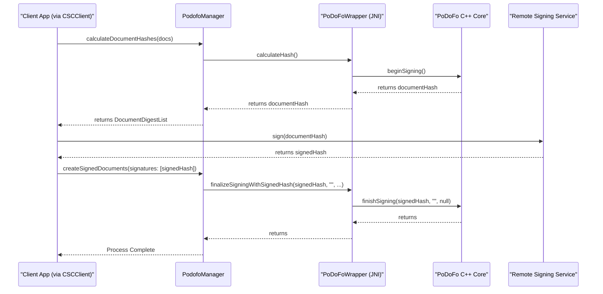
```mermaid
sequenceDiagram
    participant App as "Client App (via CSCClient)"
    participant Manager as PodofoManager
    participant Wrapper as "PoDoFoWrapper (JNI)"
    participant Core as "PoDoFo C++ Core"
    participant RemoteSigner as "Remote Signing Service"

    App->>Manager: calculateDocumentHashes(docs)
    Manager->>Wrapper: calculateHash()
    Wrapper->>Core: beginSigning()
    Core-->>Wrapper: returns documentHash
    Wrapper-->>Manager: returns documentHash
    Manager-->>App: returns DocumentDigestList

    App->>RemoteSigner: sign(documentHash)
    RemoteSigner-->>App: returns signedHash

    App->>Manager: createSignedDocuments(signatures: [signedHash])
    Manager->>Wrapper: finalizeSigningWithSignedHash(signedHash, "", ...)
    Wrapper->>Core: finishSigning(signedHash, "", null)
    Core-->>Wrapper: returns
    Wrapper-->>Manager: returns
    Manager-->>App: Process Complete
```

---

#### PAdES B-T

This flow adds a trusted timestamp to the signature.

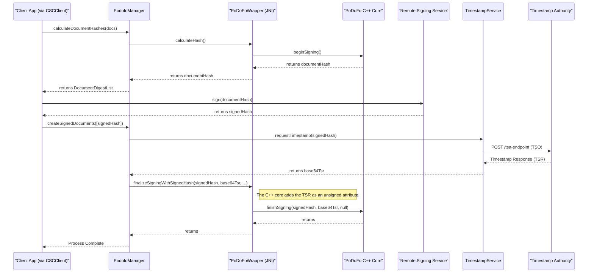
```mermaid
sequenceDiagram
    participant App as "Client App (via CSCClient)"
    participant Manager as PodofoManager
    participant Wrapper as "PoDoFoWrapper (JNI)"
    participant Core as "PoDoFo C++ Core"
    participant RemoteSigner as "Remote Signing Service"
    participant TimestampSvc as TimestampService
    participant TSA as "Timestamp Authority"

    App->>Manager: calculateDocumentHashes(docs)
    Manager->>Wrapper: calculateHash()
    Wrapper->>Core: beginSigning()
    Core-->>Wrapper: returns documentHash
    Wrapper-->>Manager: returns documentHash
    Manager-->>App: returns DocumentDigestList
    
    App->>RemoteSigner: sign(documentHash)
    RemoteSigner-->>App: returns signedHash

    App->>Manager: createSignedDocuments([signedHash])
    Manager->>TimestampSvc: requestTimestamp(signedHash)
    TimestampSvc->>TSA: POST /tsa-endpoint (TSQ)
    TSA-->>TimestampSvc: Timestamp Response (TSR)
    TimestampSvc-->>Manager: returns base64Tsr

    Manager->>Wrapper: finalizeSigningWithSignedHash(signedHash, base64Tsr, ...)
    note right of Wrapper: The C++ core adds the TSR as an unsigned attribute.
    Wrapper->>Core: finishSigning(signedHash, base64Tsr, null)
    Core-->>Wrapper: returns
    Wrapper-->>Manager: returns
    Manager-->>App: Process Complete
```

---

#### PAdES B-LT

This flow adds long-term validation (LTV) data, such as CRLs and OCSP responses.

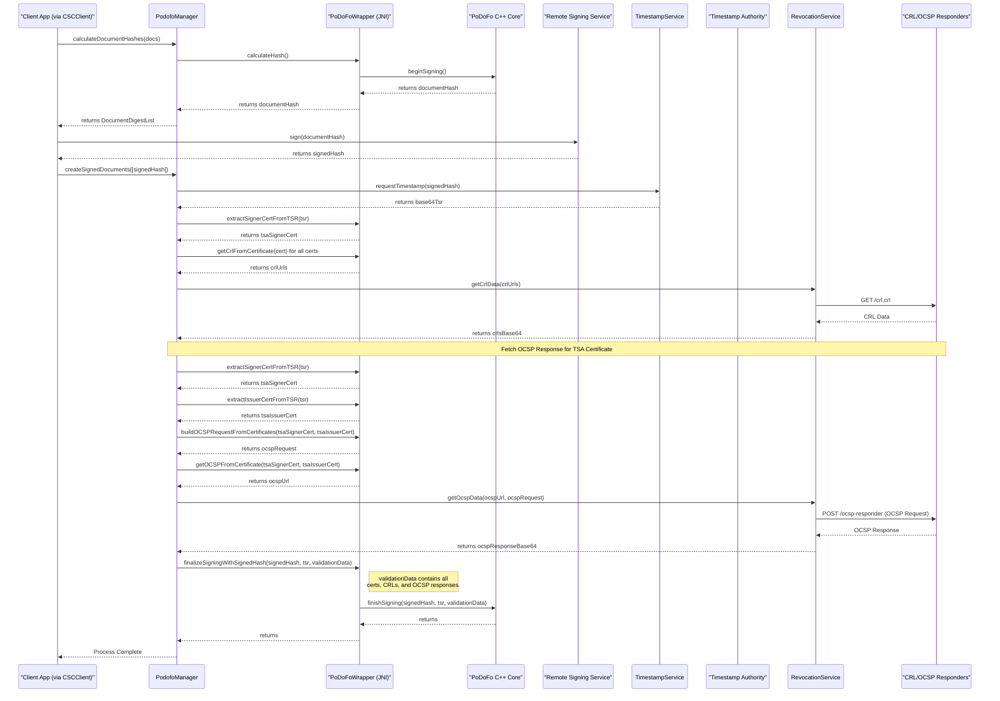
```mermaid
sequenceDiagram
    participant App as "Client App (via CSCClient)"
    participant Manager as PodofoManager
    participant Wrapper as "PoDoFoWrapper (JNI)"
    participant Core as "PoDoFo C++ Core"
    participant RemoteSigner as "Remote Signing Service"
    participant TimestampSvc as TimestampService
    participant TSA as "Timestamp Authority"
    participant RevocationSvc as RevocationService
    participant Endpoints as "CRL/OCSP Responders"

    App->>Manager: calculateDocumentHashes(docs)
    Manager->>Wrapper: calculateHash()
    Wrapper->>Core: beginSigning()
    Core-->>Wrapper: returns documentHash
    Wrapper-->>Manager: returns documentHash
    Manager-->>App: returns DocumentDigestList
    
    App->>RemoteSigner: sign(documentHash)
    RemoteSigner-->>App: returns signedHash

    App->>Manager: createSignedDocuments([signedHash])
    Manager->>TimestampSvc: requestTimestamp(signedHash)
    TimestampSvc-->>Manager: returns base64Tsr

    Manager->>Wrapper: extractSignerCertFromTSR(tsr)
    Wrapper-->>Manager: returns tsaSignerCert

    Manager->>Wrapper: getCrlFromCertificate(cert) for all certs
    Wrapper-->>Manager: returns crlUrls
    Manager->>RevocationSvc: getCrlData(crlUrls)
    RevocationSvc->>Endpoints: GET /crl.crl
    Endpoints-->>RevocationSvc: CRL Data
    RevocationSvc-->>Manager: returns crlsBase64

    note over Manager, Endpoints: Fetch OCSP Response for TSA Certificate
    Manager->>Wrapper: extractSignerCertFromTSR(tsr)
    Wrapper-->>Manager: returns tsaSignerCert
    Manager->>Wrapper: extractIssuerCertFromTSR(tsr)
    Wrapper-->>Manager: returns tsaIssuerCert
    Manager->>Wrapper: buildOCSPRequestFromCertificates(tsaSignerCert, tsaIssuerCert)
    Wrapper-->>Manager: returns ocspRequest
    Manager->>Wrapper: getOCSPFromCertificate(tsaSignerCert, tsaIssuerCert)
    Wrapper-->>Manager: returns ocspUrl
    Manager->>RevocationSvc: getOcspData(ocspUrl, ocspRequest)
    RevocationSvc->>Endpoints: POST /ocsp-responder (OCSP Request)
    Endpoints-->>RevocationSvc: OCSP Response
    RevocationSvc-->>Manager: returns ocspResponseBase64

    Manager->>Wrapper: finalizeSigningWithSignedHash(signedHash, tsr, validationData)
    note right of Wrapper: validationData contains all<br/>certs, CRLs, and OCSP responses.
    Wrapper->>Core: finishSigning(signedHash, tsr, validationData)
    Core-->>Wrapper: returns
    Wrapper-->>Manager: returns
    Manager-->>App: Process Complete
```

---

#### PAdES B-LTA

This flow adds a final document-level timestamp for long-term archival.

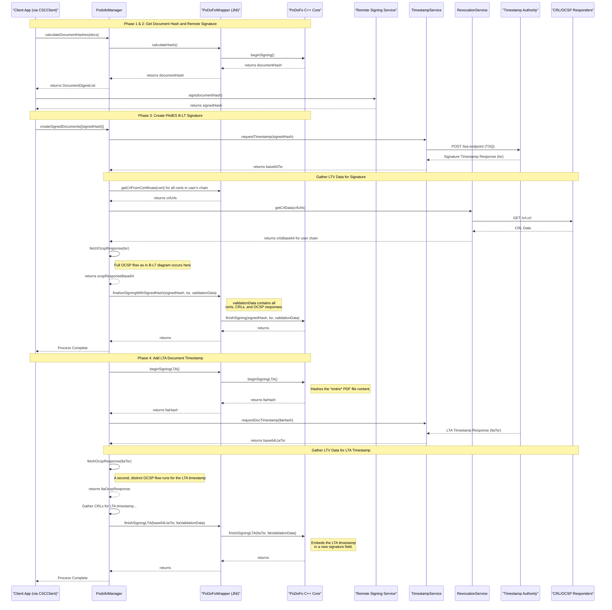
```mermaid
sequenceDiagram
    participant App as "Client App (via CSCClient)"
    participant Manager as PodofoManager
    participant Wrapper as "PoDoFoWrapper (JNI)"
    participant Core as "PoDoFo C++ Core"
    participant RemoteSigner as "Remote Signing Service"
    participant TimestampSvc as TimestampService
    participant RevocationSvc as RevocationService
    participant TSA as "Timestamp Authority"
    participant Endpoints as "CRL/OCSP Responders"

    note over App, Core: Phase 1 & 2: Get Document Hash and Remote Signature
    App->>Manager: calculateDocumentHashes(docs)
    Manager->>Wrapper: calculateHash()
    Wrapper->>Core: beginSigning()
    Core-->>Wrapper: returns documentHash
    Wrapper-->>Manager: returns documentHash
    Manager-->>App: returns DocumentDigestList
    
    App->>RemoteSigner: sign(documentHash)
    RemoteSigner-->>App: returns signedHash

    note over App, Core: Phase 3: Create PAdES B-LT Signature
    App->>Manager: createSignedDocuments([signedHash])
    Manager->>TimestampSvc: requestTimestamp(signedHash)
    TimestampSvc->>TSA: POST /tsa-endpoint (TSQ)
    TSA-->>TimestampSvc: Signature Timestamp Response (tsr)
    TimestampSvc-->>Manager: returns base64Tsr

    note over Manager, Endpoints: Gather LTV Data for Signature
    Manager->>Wrapper: getCrlFromCertificate(cert) for all certs in user's chain
    Wrapper-->>Manager: returns crlUrls
    Manager->>RevocationSvc: getCrlData(crlUrls)
    RevocationSvc->>Endpoints: GET /crl.crl
    Endpoints-->>RevocationSvc: CRL Data
    RevocationSvc-->>Manager: returns crlsBase64 for user chain

    Manager->>Manager: fetchOcspResponse(tsr)
    note right of Manager: Full OCSP flow as in B-LT diagram occurs here
    Manager-->>Manager: returns ocspResponseBase64
    
    Manager->>Wrapper: finalizeSigningWithSignedHash(signedHash, tsr, validationData)
    note right of Wrapper: validationData contains all<br/>certs, CRLs, and OCSP responses.
    Wrapper->>Core: finishSigning(signedHash, tsr, validationData)
    Core-->>Wrapper: returns
    Wrapper-->>Manager: returns
    Manager-->>App: Process Complete

    note over App, Core: Phase 4: Add LTA Document Timestamp
    Manager->>Wrapper: beginSigningLTA()
    Wrapper->>Core: beginSigningLTA()
    note right of Core: Hashes the *entire* PDF file content.
    Core-->>Wrapper: returns ltaHash
    Wrapper-->>Manager: returns ltaHash

    Manager->>TimestampSvc: requestDocTimestamp(ltaHash)
    TSA-->>TimestampSvc: LTA Timestamp Response (ltaTsr)
    TimestampSvc-->>Manager: returns base64LtaTsr

    note over Manager, Endpoints: Gather LTV Data for LTA Timestamp
    Manager->>Manager: fetchOcspResponse(ltaTsr)
    note right of Manager: A second, distinct OCSP flow runs for the LTA timestamp
    Manager-->>Manager: returns ltaOcspResponse
    Manager->>Manager: Gather CRLs for LTA timestamp...
    
    Manager->>Wrapper: finishSigningLTA(base64LtaTsr, ltaValidationData)
    Wrapper->>Core: finishSigningLTA(ltaTsr, ltaValidationData)
    note right of Core: Embeds the LTA timestamp<br/>in a new signature field.
    Core-->>Wrapper: returns
    Wrapper-->>Manager: returns
    Manager-->>App: Process Complete
```

---

### 5. Core Services and Utilities

*   **`TimestampService.kt`**: The `TimestampServiceImpl` class handles the creation of ASN.1-encoded Time-Stamp Query (TSQ) requests and sends them to the configured TSA. It encapsulates the logic for building both signature timestamps (`buildTSQ`) and document timestamps (`buildTSQForDocTimestamp`).

*   **`RevocationService.kt`**: The `RevocationServiceImpl` class provides a unified API to fetch various revocation artifacts. It contains methods to get CRL data (`getCrlData`), OCSP responses (`getOcspData`), and missing issuer certificates (`getCertificateData`) over HTTP.

---

## VIII. Android Tester App: A User Guide

### 1. Introduction

This guide provides a comprehensive walkthrough of the Android CSC Tester App, a demonstration application designed to showcase the capabilities of the EUDI Wallet Kotlin Library. The app facilitates the remote signing of PDF documents using various PAdES conformance levels, interacting with a remote CSC (Cloud Signature Consortium) service.

Due to the complexities of handling OAuth2 redirects in a simple tester application, this guide details a manual authorization workflow. This process uses the popular API tool **Postman** to intercept the authorization flow, retrieve the necessary authorization codes, and paste them back into the app. This approach allows for a clear, step-by-step demonstration of the protocol without requiring a complex web backend or custom URI scheme handling.

### 2. The Signing Flow Step-by-Step

This section will guide you through the entire process, from configuring the signature to obtaining the final, signed PDF.

#### **Postman Configuration**

Before starting, ensure Postman is configured correctly to intercept the authorization codes. In Postman's settings, disable "Automatically follow redirects" and enable "Retain headers when clicking on links". This prevents Postman from automatically following the 302 redirect, allowing you to inspect the `Location` header and extract the code.

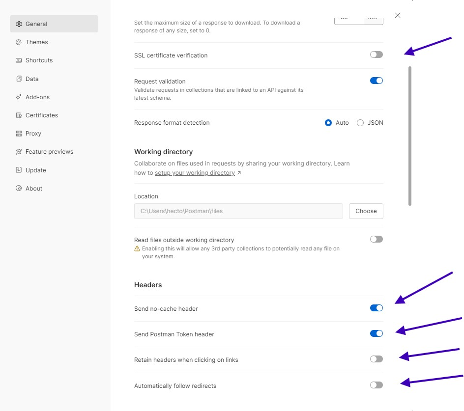

#### **Step 1: Configure Signing Parameters**

Launch the Android Tester App. The initial screen allows you to configure the signing process.

1.  **Conformance Level**: Choose the desired PAdES level (e.g., `ADES_B_LTA`).
2.  **TSA Service**: Select a Timestamping Authority. This is crucial for PAdES levels B-T and higher.
3.  Click **"Start Signing Process"**.

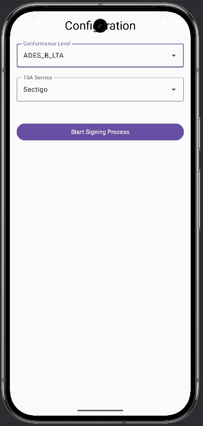

#### **Step 2: Service Authorization**

The app will now initiate the first phase of the OAuth2 flow: Service Authorization.

1.  The app displays a **Service Authorization URL**. Click **"Copy URL"**.

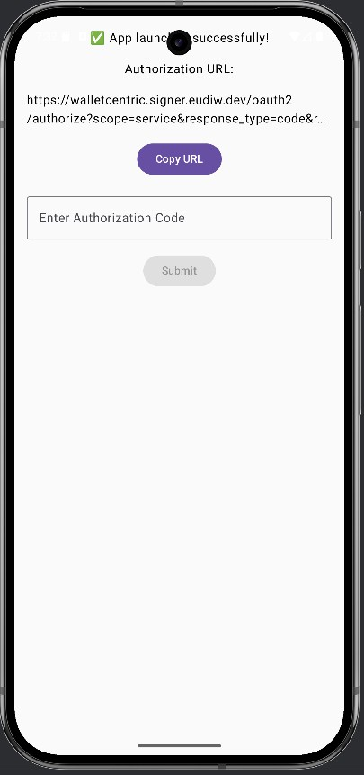

2.  Open Postman and paste the URL into the address bar. Click **"Send"**. The server responds with a `302 Found` redirect. Since redirects are disabled, Postman shows you the response headers. The `Location` header contains the URL to the login page.

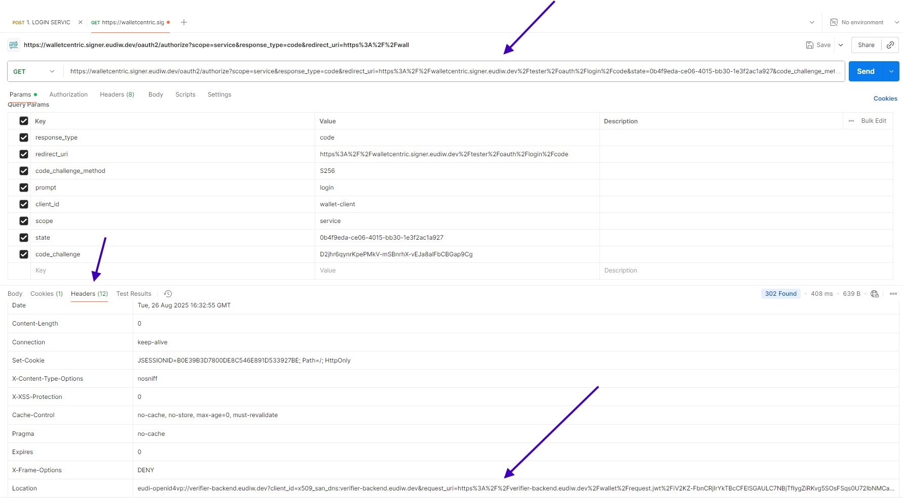

3.  The next step is to authenticate. The login page URL from the previous step is used in a `POST` request with the user's credentials. The server responds with another `302 Found` and sets a session cookie (`JSESSIONID`).

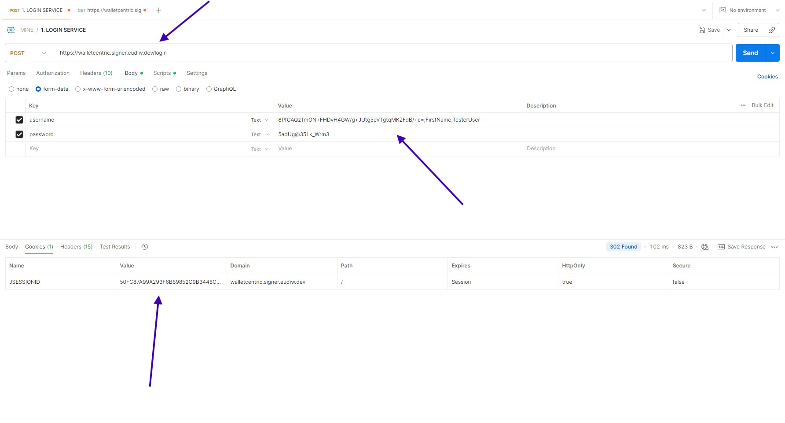

4.  Now, resend the original Service Authorization URL from Step 2.1. This time, since you have an active session cookie, the server responds with a `302 Found` that redirects to a URL containing the **authorization code**.

5.  Copy the `code` value from the `Location` header.

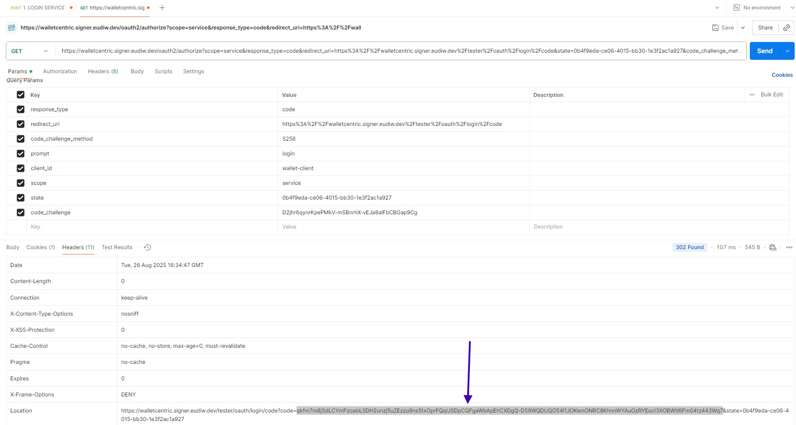

6.  Return to the Android app, paste the code into the "Enter Authorization Code" field, and click **"Submit"**.

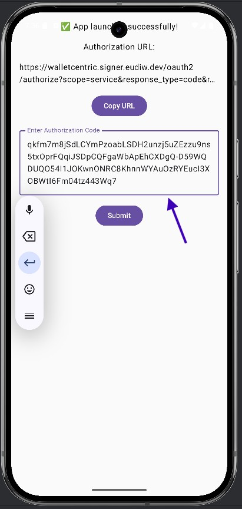

#### **Step 3: Credential Authorization**

With the service authorized, the app proceeds to the second phase: Credential Authorization. This step authorizes the use of a specific signing credential for the document hashes calculated by the app.

1.  The app now displays a **Credential Authorization URL**. Click **"Copy Credential URL"**.


2.  Switch back to Postman. Paste the new URL and click **"Send"**. Again, you'll receive a `302 Found` redirecting to the login page.

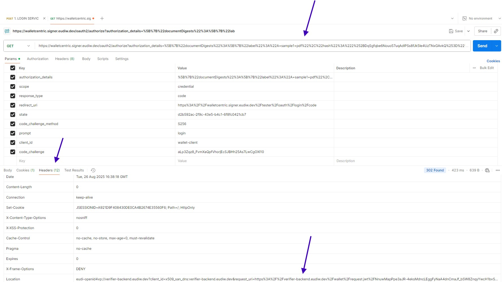

3.  As before, you must authenticate. Send a `POST` request to the login URL with credentials.

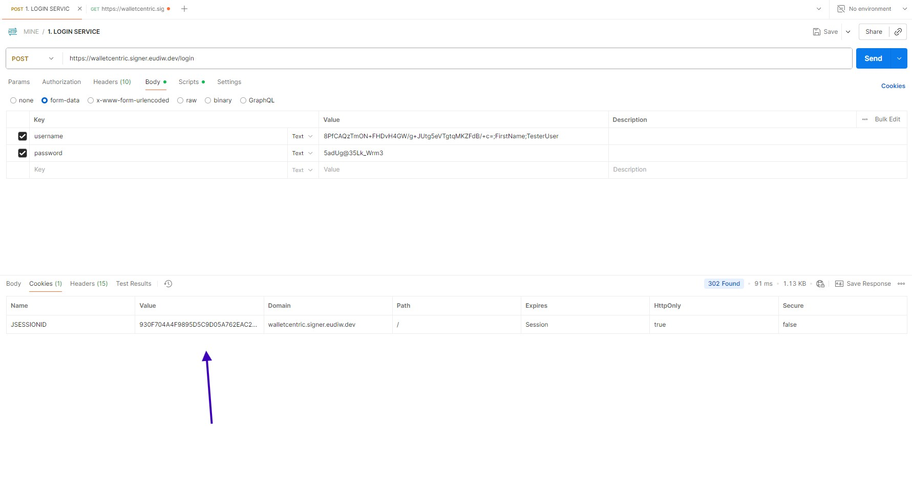

4.  Resend the Credential Authorization URL from Step 3.1. With the active session, the server now responds with a redirect containing the **credential authorization code** in the `Location` header.

5.  Copy the new `code` value.


6.  Paste this final code into the app's "Enter Credential Code" field and click **"Submit Credential Code"**.

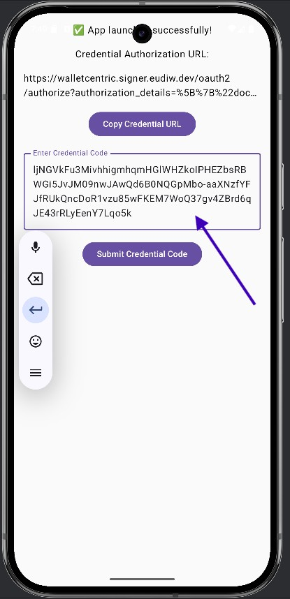

#### **Step 4: Signing Complete**

The app now has all the necessary authorizations. It sends the document hashes and the authorization details to the CSC service, which returns the cryptographic signatures. The app then injects these signatures and any required LTV (Long-Term Validation) data into the PDF document.

The signed PDF is saved in the app's documents directory. You can open it with a PDF reader to verify the signatures. A PAdES B-LTA signature will typically show two levels of signature: the user's signature and the long-term timestamp signature.

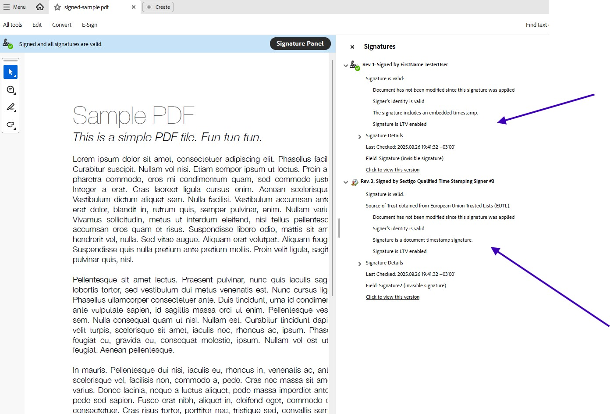

### 3. Behind the Scenes: `MainActivity.kt`

The entire logic for the Android Tester App is encapsulated within the `MainActivity.kt` file. It leverages Jetpack Compose for the UI and Kotlin Coroutines for handling asynchronous operations.

#### **Core Components and State Management**

-   **`MainActivity`**: The central class that acts as both the UI controller and the state holder.
-   **State Variables**: UI state, such as the current URL (`authUrl`, `credAuthUrl`), input codes (`authCode`, `credAuthCode`), and UI visibility (`showConfiguration`, `showAuthInput`), is managed using Jetpack Compose's `mutableStateOf`.
-   **`cscClient`**: An instance of the `CSCClient`, the main entry point to the EUDI Wallet Kotlin Library. It is initialized when the user clicks "Start Signing Process".

#### **The Authorization and Signing Flow in Code**

The process mirrors the manual steps described above, orchestrated by a series of suspend functions.

1.  **`runCscClient()`**:
    *   Triggered by the "Start Signing Process" button.
    *   Initializes `CSCClient` with the selected configuration (PAdES level, TSA URL).
    *   Calls `cscClient.prepareServiceAuthorizationRequest()`, which creates the necessary parameters for the OAuth2 flow.
    *   The `authorizationCodeURL` from the result is stored in the `authUrl` state variable, causing the UI to display the first URL.

2.  **`proceedWithAuthorization(authorizationCode: AuthorizationCode)`**:
    *   Triggered when the user submits the first code.
    *   Calls `req.authorizeWithAuthorizationCode()` to exchange the service authorization code for an access token.
    *   Uses the access token to call `listCredentials()` to fetch available signing credentials.
    *   Calls `calculateDocumentHashes()` to compute the digests of the PDF that will be signed.
    *   Calls `prepareCredentialAuthorizationRequest()` with the credential ID and document digests.
    *   The `authorizationCodeURL` from this result is stored in `credAuthUrl`, updating the UI to show the second URL for credential authorization.

3.  **`proceedWithCredentialAuthorization(credentialAuthorizationCode: AuthorizationCode)`**:
    *   Triggered when the user submits the second code.
    *   Calls `credAuthRequestPrepared.authorizeWithAuthorizationCode()` to get the final authorization needed to sign.
    *   With the final authorization, it calls `signHash()` to request the remote signature for the previously calculated hashes.
    *   Finally, it receives the signatures and calls `createSignedDocuments()` to embed them into the PDF file, completing the PAdES process.

This structured, sequential flow within `MainActivity.kt` clearly demonstrates the interaction between a client application and the CSC remote signing service, making it an excellent reference for developers integrating the Kotlin library.
  
---

## IX. Key Standards and References

This section provides direct links to the core ETSI (European Telecommunications Standards Institute) standards that define the PAdES framework. These documents are essential for a deep understanding of the technical specifications underlying the digital signing processes described in this documentation.

### PAdES Standards

*   **ETSI EN 319 142-1 V1.2.1 (2024-01) — PAdES digital signatures; Part 1: Building blocks and PAdES baseline signatures**
    *   Covers the fundamentals of PAdES-B, T, LT, and LTA, including the Document Security Store (DSS), Certificate Revocation Lists (CRL), Online Certificate Status Protocol (OCSP), certificates, and timestamps.
    *   [Link to standard](https://www.etsi.org/deliver/etsi_en/319100_319199/31914201/01.02.01_60/en_31914201v010201p.pdf)

*   **ETSI EN 319 142-2 V1.2.1 (2025-07) — PAdES digital signatures; Part 2: Additional PAdES signature profiles**
    *   Details extended profiles, including those for Long-Term Validation (LTV).
    *   [Link to standard](https://www.etsi.org/deliver/etsi_en/319100_319199/31914202/01.02.01_60/en_31914202v010201p.pdf)

*   **ETSI TS 102 778-4 V1.1.2 (2009-12) — PDF Advanced Electronic Signature Profiles; Part 4: PAdES Long Term – PAdES LTV Profile**
    *   A specific technical specification for the PAdES Long-Term Validation (LTV) profile.
    *   [Link to standard](https://www.etsi.org/deliver/etsi_ts/102700_102799/10277804/01.01.02_60/ts_10277804v010102p.pdf)

*   **ETSI TR 119 112 V1.1.1 (2019-04) — PAdES Overview – catalog of PAdES and related standards**
    *   A technical report providing an overview and catalog of PAdES and related standards.
    *   [Link to standard](https://www.etsi.org/deliver/etsi_tr/119100_119199/119112/01.01.01_60/tr_119112v010101p.pdf)

### Testing and Interoperability

*   **ETSI TS 119 144-2 V2.1.1 (2016-06) — Test suites for PAdES baseline**
    *   Provides test suites to ensure interoperability for PAdES B-B, B-T, B-LT, and B-LTA signatures.
    *   [Link to standard](https://www.etsi.org/deliver/etsi_ts/119100_119199/11914402/02.01.01_60/ts_11914402v020101p.pdf)

*   **ETSI TR 119 144-1 V1.1.1 (2016-06) — Overview of test suites for baseline and additional PAdES levels**
    *   An overview of test suites for both baseline and additional PAdES levels, including LTV.
    *   [Link to standard](https://www.etsi.org/deliver/etsi_tr/119100_119199/11914401/01.01.01_60/tr_11914401v010101p.pdf)

---

## X. All PDFs Validated with Adobe Acrobat Reader

This section confirms that all PAdES-signed PDFs generated by the PoDoFo library have been **successfully validated using Adobe Acrobat Reader**. The tests cover all conformance levels (B-B, B-T, B-LT, and B-LTA) and confirm that the generated signatures are compliant and correctly recognized as valid.

The tests for timestamped signatures (B-T, B-LT, and B-LTA) were conducted against 16 different public Timestamping Authorities (TSAs) to ensure broad compatibility.

### Timestamping Authorities Tested

1.  `http://ts.cartaodecidadao.pt/tsa/server`
2.  `https://timestamp.sectigo.com/qualified`
3.  `http://aatl-timestamp.globalsign.com/tsa/aohfewat2389535fnasgnlg5m23`
4.  `https://timestamp.sectigo.com`
5.  `http://timestamp.identrust.com`
6.  `http://ts.quovadisglobal.com/ch`
7.  `http://timestamp.digicert.com`
8.  `http://tsa.swisssign.net`
9.  `http://timestamp.entrust.net/TSS/RFC3161sha2TS`
10. `http://timestamp.certum.pl`
11. `http://freetsa.org/tsr`
12. `https://freetsa.org/tsr`
13. `http://ts.ssl.com`
14. `https://tsa.wotrus.com`
15. `http://timestamp.globalsign.com/tsa/r6advanced1`
16. `http://time.certum.pl`

### Test Artifacts

The following PDF files are the artifacts from the interoperability tests. Click on any link to open the signed document and inspect its signature properties in a compatible PDF reader.

#### PAdES B-B

*   [Signed PDF](./pdfs/Pades-B-B/signed_ADES_B_B_2025-08-31_05-25-17-PM.pdf)

#### PAdES B-T

*   **TSA 1 (Cartaodecidadao):** [View PDF](./pdfs/Pades-B-T/auto_1_ADES_B_T_TSA1_2025-08-31_05-26-58-PM.pdf)
*   **TSA 2 (Sectigo Qualified):** [View PDF](./pdfs/Pades-B-T/auto_2_ADES_B_T_TSA2_2025-08-31_05-27-04-PM.pdf)
*   **TSA 3 (Globalsign AATL):** [View PDF](./pdfs/Pades-B-T/auto_3_ADES_B_T_TSA3_2025-08-31_05-27-11-PM.pdf)
*   **TSA 4 (Sectigo Unqualified):** [View PDF](./pdfs/Pades-B-T/auto_4_ADES_B_T_TSA4_2025-08-31_05-27-17-PM.pdf)
*   **TSA 5 (Identrust):** [View PDF](./pdfs/Pades-B-T/auto_5_ADES_B_T_TSA5_2025-08-31_05-27-23-PM.pdf)
*   **TSA 6 (Quovadis):** [View PDF](./pdfs/Pades-B-T/auto_6_ADES_B_T_TSA6_2025-08-31_05-27-29-PM.pdf)
*   **TSA 7 (Digicert):** [View PDF](./pdfs/Pades-B-T/auto_7_ADES_B_T_TSA7_2025-08-31_05-27-36-PM.pdf)
*   **TSA 8 (Swisssign):** [View PDF](./pdfs/Pades-B-T/auto_8_ADES_B_T_TSA8_2025-08-31_05-27-42-PM.pdf)
*   **TSA 9 (Entrust):** [View PDF](./pdfs/Pades-B-T/auto_9_ADES_B_T_TSA9_2025-08-31_05-27-48-PM.pdf)
*   **TSA 10 (Certum):** [View PDF](./pdfs/Pades-B-T/auto_10_ADES_B_T_TSA10_2025-08-31_05-27-55-PM.pdf)
*   **TSA 11 (FreeTSA HTTP):** [View PDF](./pdfs/Pades-B-T/auto_11_ADES_B_T_TSA11_2025-08-31_05-28-01-PM.pdf)
*   **TSA 12 (FreeTSA HTTPS):** [View PDF](./pdfs/Pades-B-T/auto_12_ADES_B_T_TSA12_2025-08-31_05-28-07-PM.pdf)
*   **TSA 13 (`SSL.com`):** [View PDF](./pdfs/Pades-B-T/auto_13_ADES_B_T_TSA13_2025-08-31_05-28-14-PM.pdf)
*   **TSA 14 (Wotrus):** [View PDF](./pdfs/Pades-B-T/auto_14_ADES_B_T_TSA14_2025-08-31_05-28-19-PM.pdf)
*   **TSA 15 (Globalsign R6):** [View PDF](./pdfs/Pades-B-T/auto_15_ADES_B_T_TSA15_2025-08-31_05-28-30-PM.pdf)
*   **TSA 16 (Certum Time):** [View PDF](./pdfs/Pades-B-T/auto_16_ADES_B_T_TSA16_2025-08-31_05-28-36-PM.pdf)

#### PAdES B-LT

*   **TSA 1 (Cartaodecidadao):** [View PDF](./pdfs/Pades-B-LT/auto_17_ADES_B_LT_TSA1_2025-08-31_05-28-41-PM.pdf)
*   **TSA 2 (Sectigo Qualified):** [View PDF](./pdfs/Pades-B-LT/auto_18_ADES_B_LT_TSA2_2025-08-31_05-28-48-PM.pdf)
*   **TSA 3 (Globalsign AATL):** [View PDF](./pdfs/Pades-B-LT/auto_19_ADES_B_LT_TSA3_2025-08-31_05-28-54-PM.pdf)
*   **TSA 4 (Sectigo Unqualified):** [View PDF](./pdfs/Pades-B-LT/auto_20_ADES_B_LT_TSA4_2025-08-31_05-29-00-PM.pdf)
*   **TSA 5 (Identrust):** [View PDF](./pdfs/Pades-B-LT/auto_21_ADES_B_LT_TSA5_2025-08-31_05-29-07-PM.pdf)
*   **TSA 6 (Quovadis):** [View PDF](./pdfs/Pades-B-LT/auto_22_ADES_B_LT_TSA6_2025-08-31_05-29-14-PM.pdf)
*   **TSA 7 (Digicert):** [View PDF](./pdfs/Pades-B-LT/auto_23_ADES_B_LT_TSA7_2025-08-31_05-29-20-PM.pdf)
*   **TSA 8 (Swisssign):** [View PDF](./pdfs/Pades-B-LT/auto_24_ADES_B_LT_TSA8_2025-08-31_05-29-26-PM.pdf)
*   **TSA 9 (Entrust):** [View PDF](./pdfs/Pades-B-LT/auto_25_ADES_B_LT_TSA9_2025-08-31_05-29-32-PM.pdf)
*   **TSA 10 (Certum):** [View PDF](./pdfs/Pades-B-LT/auto_26_ADES_B_LT_TSA10_2025-08-31_05-29-39-PM.pdf)
*   **TSA 11 (FreeTSA HTTP):** [View PDF](./pdfs/Pades-B-LT/auto_27_ADES_B_LT_TSA11_2025-08-31_05-29-47-PM.pdf)
*   **TSA 12 (FreeTSA HTTPS):** [View PDF](./pdfs/Pades-B-LT/auto_28_ADES_B_LT_TSA12_2025-08-31_05-29-55-PM.pdf)
*   **TSA 13 (`SSL.com`):** [View PDF](./pdfs/Pades-B-LT/auto_29_ADES_B_LT_TSA13_2025-08-31_05-30-02-PM.pdf)
*   **TSA 14 (Wotrus):** [View PDF](./pdfs/Pades-B-LT/auto_30_ADES_B_LT_TSA14_2025-08-31_05-30-08-PM.pdf)
*   **TSA 15 (Globalsign R6):** [View PDF](./pdfs/Pades-B-LT/auto_31_ADES_B_LT_TSA15_2025-08-31_05-30-17-PM.pdf)
*   **TSA 16 (Certum Time):** [View PDF](./pdfs/Pades-B-LT/auto_32_ADES_B_LT_TSA16_2025-08-31_05-30-24-PM.pdf)

#### PAdES B-LTA

*   **TSA 1 (Cartaodecidadao):** [View PDF](./pdfs/Pades-B-LTA/auto_33_ADES_B_LTA_TSA1_2025-08-31_05-30-30-PM.pdf)
*   **TSA 2 (Sectigo Qualified):** [View PDF](./pdfs/Pades-B-LTA/auto_34_ADES_B_LTA_TSA2_2025-08-31_05-30-37-PM.pdf)
*   **TSA 3 (Globalsign AATL):** [View PDF](./pdfs/Pades-B-LTA/auto_35_ADES_B_LTA_TSA3_2025-08-31_05-30-46-PM.pdf)
*   **TSA 4 (Sectigo Unqualified):** [View PDF](./pdfs/Pades-B-LTA/auto_36_ADES_B_LTA_TSA4_2025-08-31_05-30-54-PM.pdf)
*   **TSA 5 (Identrust):** [View PDF](./pdfs/Pades-B-LTA/auto_37_ADES_B_LTA_TSA5_2025-08-31_05-31-04-PM.pdf)
*   **TSA 6 (Quovadis):** [View PDF](./pdfs/Pades-B-LTA/auto_38_ADES_B_LTA_TSA6_2025-08-31_05-31-12-PM.pdf)
*   **TSA 7 (Digicert):** [View PDF](./pdfs/Pades-B-LTA/auto_39_ADES_B_LTA_TSA7_2025-08-31_05-31-19-PM.pdf)
*   **TSA 8 (Swisssign):** [View PDF](./pdfs/Pades-B-LTA/auto_40_ADES_B_LTA_TSA8_2025-08-31_05-31-26-PM.pdf)
*   **TSA 9 (Entrust):** [View PDF](./pdfs/Pades-B-LTA/auto_41_ADES_B_LTA_TSA9_2025-08-31_05-31-32-PM.pdf)
*   **TSA 10 (Certum):** [View PDF](./pdfs/Pades-B-LTA/auto_42_ADES_B_LTA_TSA10_2025-08-31_05-31-39-PM.pdf)
*   **TSA 11 (FreeTSA HTTP):** [View PDF](./pdfs/Pades-B-LTA/auto_43_ADES_B_LTA_TSA11_2025-08-31_05-31-46-PM.pdf)
*   **TSA 12 (FreeTSA HTTPS):** [View PDF](./pdfs/Pades-B-LTA/auto_44_ADES_B_LTA_TSA12_2025-08-31_05-31-55-PM.pdf)
*   **TSA 13 (`SSL.com`):** [View PDF](./pdfs/Pades-B-LTA/auto_45_ADES_B_LTA_TSA13_2025-08-31_05-32-05-PM.pdf)
*   **TSA 14 (Wotrus):** [View PDF](./pdfs/Pades-B-LTA/auto_46_ADES_B_LTA_TSA14_2025-08-31_05-32-12-PM.pdf)
*   **TSA 15 (Globalsign R6):** [View PDF](./pdfs/Pades-B-LTA/auto_47_ADES_B_LTA_TSA15_2025-08-31_05-32-22-PM.pdf)
*   **TSA 16 (Certum Time):** [View PDF](./pdfs/Pades-B-LTA/auto_48_ADES_B_LTA_TSA16_2025-08-31_05-32-30-PM.pdf)

---

## XI. Glossary of Terms

This section provides definitions for common acronyms and technical terms used throughout this document.

*   **AdES (Advanced Electronic Signature):** A digital signature that meets the requirements of the eIDAS Regulation, including being uniquely linked to the signer and capable of identifying them.

*   **ASN.1 (Abstract Syntax Notation One):** A standard and notation that describes rules and structures for representing, encoding, transmitting, and decoding data in telecommunications and computer networking. Widely used in cryptography for defining data structures.

*   **B-B (PAdES-B-B):** Basic Electronic Signature. The fundamental level containing the digital signature and the signer's certificate. It proves document integrity and authenticity at the time of signing but lacks long-term validity evidence.

*   **B-T (PAdES-B-T):** Signature with Timestamp. Enhances a B-B signature by adding a trusted timestamp from a Timestamp Authority (TSA). This proves that the signature existed *before* a specific point in time, which is crucial for validation after the signer's certificate has expired.

*   **B-LT (PAdES-B-LT):** Signature with Long-Term Validation Material. Builds on B-T by embedding all necessary validation materials (the full certificate chain, Certificate Revocation Lists (CRLs), and/or OCSP responses) directly into the PDF's Document Security Store (DSS). This makes the signature verifiable for many years without needing external network calls.

*   **B-LTA (PAdES-B-LTA):** Signature with Long-Term with Archive Timestamp. The highest level of robustness. It adds a document-level timestamp to the entire PDF (including the B-LT signature and all its validation data). This protects the document against the future weakening of cryptographic algorithms used in the original signature.

*   **ByteRange:** A PDF-specific entry in the signature dictionary that specifies exactly which bytes of the document are covered by the digital signature, excluding the signature value itself.

*   **CMS (Cryptographic Message Syntax):** An IETF standard for cryptographically protected messages. It is used to digitally sign, digest, authenticate, or encrypt any form of digital data. It is also known as PKCS #7.

*   **CRL (Certificate Revocation List):** A list of digital certificates that have been revoked by the issuing Certificate Authority (CA) before their scheduled expiration date.

*   **DSS (Document Security Store):** A dictionary within a PDF file that stores validation-related information (like certificates, CRLs, and OCSP responses) required for Long-Term Validation (LTV) of a signature.

*   **ETSI (European Telecommunications Standards Institute):** An independent, not-for-profit standardization organization in the information and communications technology industry. ETSI produces globally-applicable standards for ICT-enabled systems, applications, and services. In the context of this document, ETSI is the body that defines the PAdES (PDF Advanced Electronic Signatures) standards, ensuring interoperability and long-term validity of digital signatures.

*   **JNI (Java Native Interface):** A programming framework that enables Java code running in a Java Virtual Machine (JVM) to call and be called by native applications (programs specific to a hardware and operating system platform) and libraries written in other languages such as C, C++, and assembly.

*   **LTV (Long-Term Validation):** The property of a digital signature that allows it to be validated long after the signing certificate has expired or been revoked. This is achieved by embedding all necessary validation materials (certificates, CRLs, OCSP responses, timestamps) into the document itself.

*   **Objective-C++:** A variant of the Objective-C language that can compile C++ code, acting as a natural bridge between the C++ core of PoDoFo and the Objective-C/Swift world of iOS.

*   **OCSP (Online Certificate Status Protocol):** An Internet protocol used for obtaining the revocation status of a digital certificate in real-time. It provides a more immediate status check than periodically updated CRLs.

*   **PAdES (PDF Advanced Electronic Signatures):** A set of ETSI standards for creating advanced electronic signatures in PDF documents. It defines specific profiles for signatures to ensure they are suitable for long-term validation.

*   **PKCS (Public-Key Cryptography Standards):** A group of standards, of which PKCS #7 (now superseded by CMS) is the most relevant for defining the structure of digital signatures.

*   **TSA (Timestamping Authority):** A trusted third party that issues timestamps to prove that a certain piece of data existed at a specific point in time. This is crucial for PAdES B-T and higher levels.

*   **TSR (Timestamp Response):** The cryptographically signed response sent by a TSA, containing the hash of the data being timestamped and the trusted time.
